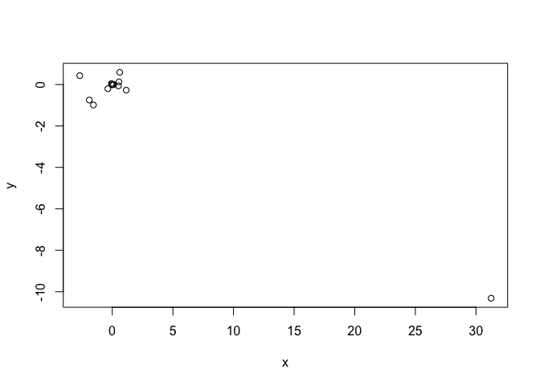

# Chapter3_Dec_13


#problems
1. Describe the null hypotheses to which the p-values given in Table 3.4
correspond. Explain what conclusions you can draw based on these
p-values. Your explanation should be phrased in terms of sales, TV,
radio, and newspaper, rather than in terms of the coefficients of the
linear model.
In Table 3.4, the null hypothesis for "TV" is that in the presence of radio
ads and newspaper ads, TV ads have no effect on sales. Similarly, the null
hypothesis for "radio" is that in the presence of TV and newspaper ads, radio
ads have no effect on sales. And there is a similar null hypothesis for
"newspaper". 
The low p-values of TV and radio suggest that the null hypotheses
are false for TV and radio. The high p-value of newspaper suggests that the null
hypothesis is true for newspaper

9. This question involves the use of multiple linear regression on the
Auto data set.

(a) Produce a scatterplot matrix which includes all of the variables
in the data set.

```r
library (MASS)
library (ISLR)
```

```
## Warning: package 'ISLR' was built under R version 3.4.2
```

```r
data(Auto)
pairs(Auto)
```

<!-- -->

(b) Compute the matrix of correlations between the variables using
the function cor(). You will need to exclude the name variable,
cor()
which is qualitative.


```r
cor(subset(Auto, select=-name))
```

```
##                     mpg  cylinders displacement horsepower     weight
## mpg           1.0000000 -0.7776175   -0.8051269 -0.7784268 -0.8322442
## cylinders    -0.7776175  1.0000000    0.9508233  0.8429834  0.8975273
## displacement -0.8051269  0.9508233    1.0000000  0.8972570  0.9329944
## horsepower   -0.7784268  0.8429834    0.8972570  1.0000000  0.8645377
## weight       -0.8322442  0.8975273    0.9329944  0.8645377  1.0000000
## acceleration  0.4233285 -0.5046834   -0.5438005 -0.6891955 -0.4168392
## year          0.5805410 -0.3456474   -0.3698552 -0.4163615 -0.3091199
## origin        0.5652088 -0.5689316   -0.6145351 -0.4551715 -0.5850054
##              acceleration       year     origin
## mpg             0.4233285  0.5805410  0.5652088
## cylinders      -0.5046834 -0.3456474 -0.5689316
## displacement   -0.5438005 -0.3698552 -0.6145351
## horsepower     -0.6891955 -0.4163615 -0.4551715
## weight         -0.4168392 -0.3091199 -0.5850054
## acceleration    1.0000000  0.2903161  0.2127458
## year            0.2903161  1.0000000  0.1815277
## origin          0.2127458  0.1815277  1.0000000
```

(c) Use the lm() function to perform a multiple linear regression
with mpg as the response and all other variables except name as
the predictors. Use the summary() function to print the results.
Comment on the output. For instance:


```r
lm.fit = lm(mpg~.-name, data=Auto)
summary(lm.fit)
```

```
## 
## Call:
## lm(formula = mpg ~ . - name, data = Auto)
## 
## Residuals:
##     Min      1Q  Median      3Q     Max 
## -9.5903 -2.1565 -0.1169  1.8690 13.0604 
## 
## Coefficients:
##                Estimate Std. Error t value Pr(>|t|)    
## (Intercept)  -17.218435   4.644294  -3.707  0.00024 ***
## cylinders     -0.493376   0.323282  -1.526  0.12780    
## displacement   0.019896   0.007515   2.647  0.00844 ** 
## horsepower    -0.016951   0.013787  -1.230  0.21963    
## weight        -0.006474   0.000652  -9.929  < 2e-16 ***
## acceleration   0.080576   0.098845   0.815  0.41548    
## year           0.750773   0.050973  14.729  < 2e-16 ***
## origin         1.426141   0.278136   5.127 4.67e-07 ***
## ---
## Signif. codes:  0 '***' 0.001 '**' 0.01 '*' 0.05 '.' 0.1 ' ' 1
## 
## Residual standard error: 3.328 on 384 degrees of freedom
## Multiple R-squared:  0.8215,	Adjusted R-squared:  0.8182 
## F-statistic: 252.4 on 7 and 384 DF,  p-value: < 2.2e-16
```

i. Is there a relationship between the predictors and the response?

Yes, there is a relatioship between the predictors and the response by testing the null hypothesis of all the regression coefficients are zero. The F-test is far from 1 (with a small p-value) is evidence for false null hypothesis. 

ii. Which predictors appear to have a statistically significant
relationship to the response?

Looking at the p-values associated with each predictor's t-statistic, we see that displacement, weight, year, and origin have a statistically significant relationship, while cylinders, horsepower, and acceleration do not.

iii. What does the coefficient for the year variable suggest?

The regression coefficient for year, r coefficients(lm.fit)["year"], suggests that for every one year, mpg increases by the coefficient.cars become more fuel efficient every year by almost 1 mpg / year

10. This question should be answered using the Carseats data set.

(a) Fit a multiple regression model to predict Sales using Price,
Urban, and US.


```r
library(ISLR)
summary(Carseats)
```

```
##      Sales          CompPrice       Income        Advertising    
##  Min.   : 0.000   Min.   : 77   Min.   : 21.00   Min.   : 0.000  
##  1st Qu.: 5.390   1st Qu.:115   1st Qu.: 42.75   1st Qu.: 0.000  
##  Median : 7.490   Median :125   Median : 69.00   Median : 5.000  
##  Mean   : 7.496   Mean   :125   Mean   : 68.66   Mean   : 6.635  
##  3rd Qu.: 9.320   3rd Qu.:135   3rd Qu.: 91.00   3rd Qu.:12.000  
##  Max.   :16.270   Max.   :175   Max.   :120.00   Max.   :29.000  
##    Population        Price        ShelveLoc        Age       
##  Min.   : 10.0   Min.   : 24.0   Bad   : 96   Min.   :25.00  
##  1st Qu.:139.0   1st Qu.:100.0   Good  : 85   1st Qu.:39.75  
##  Median :272.0   Median :117.0   Medium:219   Median :54.50  
##  Mean   :264.8   Mean   :115.8                Mean   :53.32  
##  3rd Qu.:398.5   3rd Qu.:131.0                3rd Qu.:66.00  
##  Max.   :509.0   Max.   :191.0                Max.   :80.00  
##    Education    Urban       US     
##  Min.   :10.0   No :118   No :142  
##  1st Qu.:12.0   Yes:282   Yes:258  
##  Median :14.0                      
##  Mean   :13.9                      
##  3rd Qu.:16.0                      
##  Max.   :18.0
```

```r
attach(Carseats)
lm.fit1 = lm(Sales~Price+Urban+US)
summary(lm.fit1)
```

```
## 
## Call:
## lm(formula = Sales ~ Price + Urban + US)
## 
## Residuals:
##     Min      1Q  Median      3Q     Max 
## -6.9206 -1.6220 -0.0564  1.5786  7.0581 
## 
## Coefficients:
##              Estimate Std. Error t value Pr(>|t|)    
## (Intercept) 13.043469   0.651012  20.036  < 2e-16 ***
## Price       -0.054459   0.005242 -10.389  < 2e-16 ***
## UrbanYes    -0.021916   0.271650  -0.081    0.936    
## USYes        1.200573   0.259042   4.635 4.86e-06 ***
## ---
## Signif. codes:  0 '***' 0.001 '**' 0.01 '*' 0.05 '.' 0.1 ' ' 1
## 
## Residual standard error: 2.472 on 396 degrees of freedom
## Multiple R-squared:  0.2393,	Adjusted R-squared:  0.2335 
## F-statistic: 41.52 on 3 and 396 DF,  p-value: < 2.2e-16
```

(b) Provide an interpretation of each coefficient in the model. Be
careful—some of the variables in the model are qualitative!

Price: The linear regression suggests a relationship between price and sales given the low p-value of the t-statistic. The coefficient states a negative relationship between Price and 
Sales: as Price increases, Sales decreases.

UrbanYes: The linear regression suggests that there isn't a relationship between the location of the store and the number of sales based on the high p-value of the t-statistic.

USYes:The linear regression suggests there is a relationship between whether the store is in the US or not and the amount of sales. The coefficient states a positive relationship between USYes and Sales: if the store is in the US, the sales will increase by approximately 1201 units.

(c) Write out the model in equation form, being careful to handle
the qualitative variables properly.

Sales = 13.04 + -0.05 Price + -0.02 UrbanYes + 1.20 USYes

(d) For which of the predictors can you reject the null hypothesis
H0 : βj = 0?

Price and USYes, based on the p-values, F-statistic, and p-value of the F-statistic.

(e) On the basis of your response to the previous question, fit a smaller model that only uses the predictors for which there is evidence of association with the outcome.


```r
lm.fit2 = lm(Sales ~ Price + US)
summary(lm.fit2)
```

```
## 
## Call:
## lm(formula = Sales ~ Price + US)
## 
## Residuals:
##     Min      1Q  Median      3Q     Max 
## -6.9269 -1.6286 -0.0574  1.5766  7.0515 
## 
## Coefficients:
##             Estimate Std. Error t value Pr(>|t|)    
## (Intercept) 13.03079    0.63098  20.652  < 2e-16 ***
## Price       -0.05448    0.00523 -10.416  < 2e-16 ***
## USYes        1.19964    0.25846   4.641 4.71e-06 ***
## ---
## Signif. codes:  0 '***' 0.001 '**' 0.01 '*' 0.05 '.' 0.1 ' ' 1
## 
## Residual standard error: 2.469 on 397 degrees of freedom
## Multiple R-squared:  0.2393,	Adjusted R-squared:  0.2354 
## F-statistic: 62.43 on 2 and 397 DF,  p-value: < 2.2e-16
```

(f) How well do the models in (a) and (e) fit the data?

Based on the RSE and R^2 of the linear regressions, (e) fitting the data slightly better.

(g) Using the model from (e), obtain 95% confidence intervals for
the coefficient(s).


```r
confint(lm.fit2)
```

```
##                   2.5 %      97.5 %
## (Intercept) 11.79032020 14.27126531
## Price       -0.06475984 -0.04419543
## USYes        0.69151957  1.70776632
```

15. This problem involves the Boston data set, which we saw in the lab
for this chapter. We will now try to predict per capita crime rate
using the other variables in this data set. In other words, per capita
crime rate is the response, and the other variables are the predictors.

(a) For each predictor, fit a simple linear regression model to predict
the response. Describe your results. In which of the models is
there a statistically significant association between the predictor
and the response? Create some plots to back up your assertions.


```r
library(MASS)
summary(Boston)
```

```
##       crim                zn             indus            chas        
##  Min.   : 0.00632   Min.   :  0.00   Min.   : 0.46   Min.   :0.00000  
##  1st Qu.: 0.08204   1st Qu.:  0.00   1st Qu.: 5.19   1st Qu.:0.00000  
##  Median : 0.25651   Median :  0.00   Median : 9.69   Median :0.00000  
##  Mean   : 3.61352   Mean   : 11.36   Mean   :11.14   Mean   :0.06917  
##  3rd Qu.: 3.67708   3rd Qu.: 12.50   3rd Qu.:18.10   3rd Qu.:0.00000  
##  Max.   :88.97620   Max.   :100.00   Max.   :27.74   Max.   :1.00000  
##       nox               rm             age              dis        
##  Min.   :0.3850   Min.   :3.561   Min.   :  2.90   Min.   : 1.130  
##  1st Qu.:0.4490   1st Qu.:5.886   1st Qu.: 45.02   1st Qu.: 2.100  
##  Median :0.5380   Median :6.208   Median : 77.50   Median : 3.207  
##  Mean   :0.5547   Mean   :6.285   Mean   : 68.57   Mean   : 3.795  
##  3rd Qu.:0.6240   3rd Qu.:6.623   3rd Qu.: 94.08   3rd Qu.: 5.188  
##  Max.   :0.8710   Max.   :8.780   Max.   :100.00   Max.   :12.127  
##       rad              tax           ptratio          black       
##  Min.   : 1.000   Min.   :187.0   Min.   :12.60   Min.   :  0.32  
##  1st Qu.: 4.000   1st Qu.:279.0   1st Qu.:17.40   1st Qu.:375.38  
##  Median : 5.000   Median :330.0   Median :19.05   Median :391.44  
##  Mean   : 9.549   Mean   :408.2   Mean   :18.46   Mean   :356.67  
##  3rd Qu.:24.000   3rd Qu.:666.0   3rd Qu.:20.20   3rd Qu.:396.23  
##  Max.   :24.000   Max.   :711.0   Max.   :22.00   Max.   :396.90  
##      lstat            medv      
##  Min.   : 1.73   Min.   : 5.00  
##  1st Qu.: 6.95   1st Qu.:17.02  
##  Median :11.36   Median :21.20  
##  Mean   :12.65   Mean   :22.53  
##  3rd Qu.:16.95   3rd Qu.:25.00  
##  Max.   :37.97   Max.   :50.00
```

```r
Boston$chas <- factor(Boston$chas, labels = c("N","Y"))
summary(Boston)
```

```
##       crim                zn             indus       chas   
##  Min.   : 0.00632   Min.   :  0.00   Min.   : 0.46   N:471  
##  1st Qu.: 0.08204   1st Qu.:  0.00   1st Qu.: 5.19   Y: 35  
##  Median : 0.25651   Median :  0.00   Median : 9.69          
##  Mean   : 3.61352   Mean   : 11.36   Mean   :11.14          
##  3rd Qu.: 3.67708   3rd Qu.: 12.50   3rd Qu.:18.10          
##  Max.   :88.97620   Max.   :100.00   Max.   :27.74          
##       nox               rm             age              dis        
##  Min.   :0.3850   Min.   :3.561   Min.   :  2.90   Min.   : 1.130  
##  1st Qu.:0.4490   1st Qu.:5.886   1st Qu.: 45.02   1st Qu.: 2.100  
##  Median :0.5380   Median :6.208   Median : 77.50   Median : 3.207  
##  Mean   :0.5547   Mean   :6.285   Mean   : 68.57   Mean   : 3.795  
##  3rd Qu.:0.6240   3rd Qu.:6.623   3rd Qu.: 94.08   3rd Qu.: 5.188  
##  Max.   :0.8710   Max.   :8.780   Max.   :100.00   Max.   :12.127  
##       rad              tax           ptratio          black       
##  Min.   : 1.000   Min.   :187.0   Min.   :12.60   Min.   :  0.32  
##  1st Qu.: 4.000   1st Qu.:279.0   1st Qu.:17.40   1st Qu.:375.38  
##  Median : 5.000   Median :330.0   Median :19.05   Median :391.44  
##  Mean   : 9.549   Mean   :408.2   Mean   :18.46   Mean   :356.67  
##  3rd Qu.:24.000   3rd Qu.:666.0   3rd Qu.:20.20   3rd Qu.:396.23  
##  Max.   :24.000   Max.   :711.0   Max.   :22.00   Max.   :396.90  
##      lstat            medv      
##  Min.   : 1.73   Min.   : 5.00  
##  1st Qu.: 6.95   1st Qu.:17.02  
##  Median :11.36   Median :21.20  
##  Mean   :12.65   Mean   :22.53  
##  3rd Qu.:16.95   3rd Qu.:25.00  
##  Max.   :37.97   Max.   :50.00
```

```r
attach(Boston)
lm.zn = lm(crim~zn)
summary(lm.zn) # yes
```

```
## 
## Call:
## lm(formula = crim ~ zn)
## 
## Residuals:
##    Min     1Q Median     3Q    Max 
## -4.429 -4.222 -2.620  1.250 84.523 
## 
## Coefficients:
##             Estimate Std. Error t value Pr(>|t|)    
## (Intercept)  4.45369    0.41722  10.675  < 2e-16 ***
## zn          -0.07393    0.01609  -4.594 5.51e-06 ***
## ---
## Signif. codes:  0 '***' 0.001 '**' 0.01 '*' 0.05 '.' 0.1 ' ' 1
## 
## Residual standard error: 8.435 on 504 degrees of freedom
## Multiple R-squared:  0.04019,	Adjusted R-squared:  0.03828 
## F-statistic:  21.1 on 1 and 504 DF,  p-value: 5.506e-06
```

```r
lm.indus = lm(crim~indus)
summary(lm.indus) # yes
```

```
## 
## Call:
## lm(formula = crim ~ indus)
## 
## Residuals:
##     Min      1Q  Median      3Q     Max 
## -11.972  -2.698  -0.736   0.712  81.813 
## 
## Coefficients:
##             Estimate Std. Error t value Pr(>|t|)    
## (Intercept) -2.06374    0.66723  -3.093  0.00209 ** 
## indus        0.50978    0.05102   9.991  < 2e-16 ***
## ---
## Signif. codes:  0 '***' 0.001 '**' 0.01 '*' 0.05 '.' 0.1 ' ' 1
## 
## Residual standard error: 7.866 on 504 degrees of freedom
## Multiple R-squared:  0.1653,	Adjusted R-squared:  0.1637 
## F-statistic: 99.82 on 1 and 504 DF,  p-value: < 2.2e-16
```

```r
lm.chas = lm(crim~chas) 
summary(lm.chas) # no
```

```
## 
## Call:
## lm(formula = crim ~ chas)
## 
## Residuals:
##    Min     1Q Median     3Q    Max 
## -3.738 -3.661 -3.435  0.018 85.232 
## 
## Coefficients:
##             Estimate Std. Error t value Pr(>|t|)    
## (Intercept)   3.7444     0.3961   9.453   <2e-16 ***
## chasY        -1.8928     1.5061  -1.257    0.209    
## ---
## Signif. codes:  0 '***' 0.001 '**' 0.01 '*' 0.05 '.' 0.1 ' ' 1
## 
## Residual standard error: 8.597 on 504 degrees of freedom
## Multiple R-squared:  0.003124,	Adjusted R-squared:  0.001146 
## F-statistic: 1.579 on 1 and 504 DF,  p-value: 0.2094
```

```r
lm.nox = lm(crim~nox)
summary(lm.nox) # yes
```

```
## 
## Call:
## lm(formula = crim ~ nox)
## 
## Residuals:
##     Min      1Q  Median      3Q     Max 
## -12.371  -2.738  -0.974   0.559  81.728 
## 
## Coefficients:
##             Estimate Std. Error t value Pr(>|t|)    
## (Intercept)  -13.720      1.699  -8.073 5.08e-15 ***
## nox           31.249      2.999  10.419  < 2e-16 ***
## ---
## Signif. codes:  0 '***' 0.001 '**' 0.01 '*' 0.05 '.' 0.1 ' ' 1
## 
## Residual standard error: 7.81 on 504 degrees of freedom
## Multiple R-squared:  0.1772,	Adjusted R-squared:  0.1756 
## F-statistic: 108.6 on 1 and 504 DF,  p-value: < 2.2e-16
```

```r
lm.rm = lm(crim~rm)
summary(lm.rm) # yes
```

```
## 
## Call:
## lm(formula = crim ~ rm)
## 
## Residuals:
##    Min     1Q Median     3Q    Max 
## -6.604 -3.952 -2.654  0.989 87.197 
## 
## Coefficients:
##             Estimate Std. Error t value Pr(>|t|)    
## (Intercept)   20.482      3.365   6.088 2.27e-09 ***
## rm            -2.684      0.532  -5.045 6.35e-07 ***
## ---
## Signif. codes:  0 '***' 0.001 '**' 0.01 '*' 0.05 '.' 0.1 ' ' 1
## 
## Residual standard error: 8.401 on 504 degrees of freedom
## Multiple R-squared:  0.04807,	Adjusted R-squared:  0.04618 
## F-statistic: 25.45 on 1 and 504 DF,  p-value: 6.347e-07
```

```r
lm.age = lm(crim~age)
summary(lm.age) # yes
```

```
## 
## Call:
## lm(formula = crim ~ age)
## 
## Residuals:
##    Min     1Q Median     3Q    Max 
## -6.789 -4.257 -1.230  1.527 82.849 
## 
## Coefficients:
##             Estimate Std. Error t value Pr(>|t|)    
## (Intercept) -3.77791    0.94398  -4.002 7.22e-05 ***
## age          0.10779    0.01274   8.463 2.85e-16 ***
## ---
## Signif. codes:  0 '***' 0.001 '**' 0.01 '*' 0.05 '.' 0.1 ' ' 1
## 
## Residual standard error: 8.057 on 504 degrees of freedom
## Multiple R-squared:  0.1244,	Adjusted R-squared:  0.1227 
## F-statistic: 71.62 on 1 and 504 DF,  p-value: 2.855e-16
```

```r
lm.dis = lm(crim~dis)
summary(lm.dis) # yes
```

```
## 
## Call:
## lm(formula = crim ~ dis)
## 
## Residuals:
##    Min     1Q Median     3Q    Max 
## -6.708 -4.134 -1.527  1.516 81.674 
## 
## Coefficients:
##             Estimate Std. Error t value Pr(>|t|)    
## (Intercept)   9.4993     0.7304  13.006   <2e-16 ***
## dis          -1.5509     0.1683  -9.213   <2e-16 ***
## ---
## Signif. codes:  0 '***' 0.001 '**' 0.01 '*' 0.05 '.' 0.1 ' ' 1
## 
## Residual standard error: 7.965 on 504 degrees of freedom
## Multiple R-squared:  0.1441,	Adjusted R-squared:  0.1425 
## F-statistic: 84.89 on 1 and 504 DF,  p-value: < 2.2e-16
```

```r
lm.rad = lm(crim~rad)
summary(lm.rad) # yes
```

```
## 
## Call:
## lm(formula = crim ~ rad)
## 
## Residuals:
##     Min      1Q  Median      3Q     Max 
## -10.164  -1.381  -0.141   0.660  76.433 
## 
## Coefficients:
##             Estimate Std. Error t value Pr(>|t|)    
## (Intercept) -2.28716    0.44348  -5.157 3.61e-07 ***
## rad          0.61791    0.03433  17.998  < 2e-16 ***
## ---
## Signif. codes:  0 '***' 0.001 '**' 0.01 '*' 0.05 '.' 0.1 ' ' 1
## 
## Residual standard error: 6.718 on 504 degrees of freedom
## Multiple R-squared:  0.3913,	Adjusted R-squared:   0.39 
## F-statistic: 323.9 on 1 and 504 DF,  p-value: < 2.2e-16
```

```r
lm.tax = lm(crim~tax)
summary(lm.tax) # yes
```

```
## 
## Call:
## lm(formula = crim ~ tax)
## 
## Residuals:
##     Min      1Q  Median      3Q     Max 
## -12.513  -2.738  -0.194   1.065  77.696 
## 
## Coefficients:
##              Estimate Std. Error t value Pr(>|t|)    
## (Intercept) -8.528369   0.815809  -10.45   <2e-16 ***
## tax          0.029742   0.001847   16.10   <2e-16 ***
## ---
## Signif. codes:  0 '***' 0.001 '**' 0.01 '*' 0.05 '.' 0.1 ' ' 1
## 
## Residual standard error: 6.997 on 504 degrees of freedom
## Multiple R-squared:  0.3396,	Adjusted R-squared:  0.3383 
## F-statistic: 259.2 on 1 and 504 DF,  p-value: < 2.2e-16
```

```r
lm.ptratio = lm(crim~ptratio)
summary(lm.ptratio) # yes
```

```
## 
## Call:
## lm(formula = crim ~ ptratio)
## 
## Residuals:
##    Min     1Q Median     3Q    Max 
## -7.654 -3.985 -1.912  1.825 83.353 
## 
## Coefficients:
##             Estimate Std. Error t value Pr(>|t|)    
## (Intercept) -17.6469     3.1473  -5.607 3.40e-08 ***
## ptratio       1.1520     0.1694   6.801 2.94e-11 ***
## ---
## Signif. codes:  0 '***' 0.001 '**' 0.01 '*' 0.05 '.' 0.1 ' ' 1
## 
## Residual standard error: 8.24 on 504 degrees of freedom
## Multiple R-squared:  0.08407,	Adjusted R-squared:  0.08225 
## F-statistic: 46.26 on 1 and 504 DF,  p-value: 2.943e-11
```

```r
lm.black = lm(crim~black)
summary(lm.black) # yes
```

```
## 
## Call:
## lm(formula = crim ~ black)
## 
## Residuals:
##     Min      1Q  Median      3Q     Max 
## -13.756  -2.299  -2.095  -1.296  86.822 
## 
## Coefficients:
##              Estimate Std. Error t value Pr(>|t|)    
## (Intercept) 16.553529   1.425903  11.609   <2e-16 ***
## black       -0.036280   0.003873  -9.367   <2e-16 ***
## ---
## Signif. codes:  0 '***' 0.001 '**' 0.01 '*' 0.05 '.' 0.1 ' ' 1
## 
## Residual standard error: 7.946 on 504 degrees of freedom
## Multiple R-squared:  0.1483,	Adjusted R-squared:  0.1466 
## F-statistic: 87.74 on 1 and 504 DF,  p-value: < 2.2e-16
```

```r
lm.lstat = lm(crim~lstat)
summary(lm.lstat) # yes
```

```
## 
## Call:
## lm(formula = crim ~ lstat)
## 
## Residuals:
##     Min      1Q  Median      3Q     Max 
## -13.925  -2.822  -0.664   1.079  82.862 
## 
## Coefficients:
##             Estimate Std. Error t value Pr(>|t|)    
## (Intercept) -3.33054    0.69376  -4.801 2.09e-06 ***
## lstat        0.54880    0.04776  11.491  < 2e-16 ***
## ---
## Signif. codes:  0 '***' 0.001 '**' 0.01 '*' 0.05 '.' 0.1 ' ' 1
## 
## Residual standard error: 7.664 on 504 degrees of freedom
## Multiple R-squared:  0.2076,	Adjusted R-squared:  0.206 
## F-statistic:   132 on 1 and 504 DF,  p-value: < 2.2e-16
```

```r
lm.medv = lm(crim~medv)
summary(lm.medv) # yes
```

```
## 
## Call:
## lm(formula = crim ~ medv)
## 
## Residuals:
##    Min     1Q Median     3Q    Max 
## -9.071 -4.022 -2.343  1.298 80.957 
## 
## Coefficients:
##             Estimate Std. Error t value Pr(>|t|)    
## (Intercept) 11.79654    0.93419   12.63   <2e-16 ***
## medv        -0.36316    0.03839   -9.46   <2e-16 ***
## ---
## Signif. codes:  0 '***' 0.001 '**' 0.01 '*' 0.05 '.' 0.1 ' ' 1
## 
## Residual standard error: 7.934 on 504 degrees of freedom
## Multiple R-squared:  0.1508,	Adjusted R-squared:  0.1491 
## F-statistic: 89.49 on 1 and 504 DF,  p-value: < 2.2e-16
```

(b) Fit a multiple regression model to predict the response using
all of the predictors. Describe your results. For which predictors
can we reject the null hypothesis H0 : βj = 0?


```r
lm.fit.all = lm(crim~., data=Boston)
summary(lm.fit.all)
```

```
## 
## Call:
## lm(formula = crim ~ ., data = Boston)
## 
## Residuals:
##    Min     1Q Median     3Q    Max 
## -9.924 -2.120 -0.353  1.019 75.051 
## 
## Coefficients:
##               Estimate Std. Error t value Pr(>|t|)    
## (Intercept)  17.033228   7.234903   2.354 0.018949 *  
## zn            0.044855   0.018734   2.394 0.017025 *  
## indus        -0.063855   0.083407  -0.766 0.444294    
## chasY        -0.749134   1.180147  -0.635 0.525867    
## nox         -10.313535   5.275536  -1.955 0.051152 .  
## rm            0.430131   0.612830   0.702 0.483089    
## age           0.001452   0.017925   0.081 0.935488    
## dis          -0.987176   0.281817  -3.503 0.000502 ***
## rad           0.588209   0.088049   6.680 6.46e-11 ***
## tax          -0.003780   0.005156  -0.733 0.463793    
## ptratio      -0.271081   0.186450  -1.454 0.146611    
## black        -0.007538   0.003673  -2.052 0.040702 *  
## lstat         0.126211   0.075725   1.667 0.096208 .  
## medv         -0.198887   0.060516  -3.287 0.001087 ** 
## ---
## Signif. codes:  0 '***' 0.001 '**' 0.01 '*' 0.05 '.' 0.1 ' ' 1
## 
## Residual standard error: 6.439 on 492 degrees of freedom
## Multiple R-squared:  0.454,	Adjusted R-squared:  0.4396 
## F-statistic: 31.47 on 13 and 492 DF,  p-value: < 2.2e-16
```

```r
#reject the null hypothesis for zn, dis, rad, black, medv
```

(c) How do your results from (a) compare to your results from (b)?
Create a plot displaying the univariate regression coefficients
from (a) on the x-axis, and the multiple regression coefficients
from (b) on the y-axis. That is, each predictor is displayed as a
single point in the plot. Its coefficient in a simple linear regression
model is shown on the x-axis, and its coefficient estimate
in the multiple linear regression model is shown on the y-axis.


```r
x = c(coefficients(lm.zn)[2],
      coefficients(lm.indus)[2],
      coefficients(lm.chas)[2],
      coefficients(lm.nox)[2],
      coefficients(lm.rm)[2],
      coefficients(lm.age)[2],
      coefficients(lm.dis)[2],
      coefficients(lm.rad)[2],
      coefficients(lm.tax)[2],
      coefficients(lm.ptratio)[2],
      coefficients(lm.black)[2],
      coefficients(lm.lstat)[2],
      coefficients(lm.medv)[2])
y = coefficients(lm.fit.all)[2:14]
plot(x, y)
```

<!-- -->

```r
#Coefficient for nox is approximately -10 in univariate model and 31 in multiple regression model.
```

(d) Is there evidence of non-linear association between any of the
predictors and the response? To answer this question, for each
predictor X, fit a model of the form
Y = β0 + β1X + β2X2 + β3X3 + e.


```r
lm.zn = lm(crim~poly(zn,3))
summary(lm.zn) 
```

```
## 
## Call:
## lm(formula = crim ~ poly(zn, 3))
## 
## Residuals:
##    Min     1Q Median     3Q    Max 
## -4.821 -4.614 -1.294  0.473 84.130 
## 
## Coefficients:
##              Estimate Std. Error t value Pr(>|t|)    
## (Intercept)    3.6135     0.3722   9.709  < 2e-16 ***
## poly(zn, 3)1 -38.7498     8.3722  -4.628  4.7e-06 ***
## poly(zn, 3)2  23.9398     8.3722   2.859  0.00442 ** 
## poly(zn, 3)3 -10.0719     8.3722  -1.203  0.22954    
## ---
## Signif. codes:  0 '***' 0.001 '**' 0.01 '*' 0.05 '.' 0.1 ' ' 1
## 
## Residual standard error: 8.372 on 502 degrees of freedom
## Multiple R-squared:  0.05824,	Adjusted R-squared:  0.05261 
## F-statistic: 10.35 on 3 and 502 DF,  p-value: 1.281e-06
```

```r
lm.indus = lm(crim~poly(indus,3))
summary(lm.indus)
```

```
## 
## Call:
## lm(formula = crim ~ poly(indus, 3))
## 
## Residuals:
##    Min     1Q Median     3Q    Max 
## -8.278 -2.514  0.054  0.764 79.713 
## 
## Coefficients:
##                 Estimate Std. Error t value Pr(>|t|)    
## (Intercept)        3.614      0.330  10.950  < 2e-16 ***
## poly(indus, 3)1   78.591      7.423  10.587  < 2e-16 ***
## poly(indus, 3)2  -24.395      7.423  -3.286  0.00109 ** 
## poly(indus, 3)3  -54.130      7.423  -7.292  1.2e-12 ***
## ---
## Signif. codes:  0 '***' 0.001 '**' 0.01 '*' 0.05 '.' 0.1 ' ' 1
## 
## Residual standard error: 7.423 on 502 degrees of freedom
## Multiple R-squared:  0.2597,	Adjusted R-squared:  0.2552 
## F-statistic: 58.69 on 3 and 502 DF,  p-value: < 2.2e-16
```

```r
# lm.chas = lm(crim~poly(chas,3)) : qualitative predictor
lm.nox = lm(crim~poly(nox,3))
summary(lm.nox) 
```

```
## 
## Call:
## lm(formula = crim ~ poly(nox, 3))
## 
## Residuals:
##    Min     1Q Median     3Q    Max 
## -9.110 -2.068 -0.255  0.739 78.302 
## 
## Coefficients:
##               Estimate Std. Error t value Pr(>|t|)    
## (Intercept)     3.6135     0.3216  11.237  < 2e-16 ***
## poly(nox, 3)1  81.3720     7.2336  11.249  < 2e-16 ***
## poly(nox, 3)2 -28.8286     7.2336  -3.985 7.74e-05 ***
## poly(nox, 3)3 -60.3619     7.2336  -8.345 6.96e-16 ***
## ---
## Signif. codes:  0 '***' 0.001 '**' 0.01 '*' 0.05 '.' 0.1 ' ' 1
## 
## Residual standard error: 7.234 on 502 degrees of freedom
## Multiple R-squared:  0.297,	Adjusted R-squared:  0.2928 
## F-statistic: 70.69 on 3 and 502 DF,  p-value: < 2.2e-16
```

```r
lm.rm = lm(crim~poly(rm,3))
summary(lm.rm) 
```

```
## 
## Call:
## lm(formula = crim ~ poly(rm, 3))
## 
## Residuals:
##     Min      1Q  Median      3Q     Max 
## -18.485  -3.468  -2.221  -0.015  87.219 
## 
## Coefficients:
##              Estimate Std. Error t value Pr(>|t|)    
## (Intercept)    3.6135     0.3703   9.758  < 2e-16 ***
## poly(rm, 3)1 -42.3794     8.3297  -5.088 5.13e-07 ***
## poly(rm, 3)2  26.5768     8.3297   3.191  0.00151 ** 
## poly(rm, 3)3  -5.5103     8.3297  -0.662  0.50858    
## ---
## Signif. codes:  0 '***' 0.001 '**' 0.01 '*' 0.05 '.' 0.1 ' ' 1
## 
## Residual standard error: 8.33 on 502 degrees of freedom
## Multiple R-squared:  0.06779,	Adjusted R-squared:  0.06222 
## F-statistic: 12.17 on 3 and 502 DF,  p-value: 1.067e-07
```

```r
lm.age = lm(crim~poly(age,3))
summary(lm.age) 
```

```
## 
## Call:
## lm(formula = crim ~ poly(age, 3))
## 
## Residuals:
##    Min     1Q Median     3Q    Max 
## -9.762 -2.673 -0.516  0.019 82.842 
## 
## Coefficients:
##               Estimate Std. Error t value Pr(>|t|)    
## (Intercept)     3.6135     0.3485  10.368  < 2e-16 ***
## poly(age, 3)1  68.1820     7.8397   8.697  < 2e-16 ***
## poly(age, 3)2  37.4845     7.8397   4.781 2.29e-06 ***
## poly(age, 3)3  21.3532     7.8397   2.724  0.00668 ** 
## ---
## Signif. codes:  0 '***' 0.001 '**' 0.01 '*' 0.05 '.' 0.1 ' ' 1
## 
## Residual standard error: 7.84 on 502 degrees of freedom
## Multiple R-squared:  0.1742,	Adjusted R-squared:  0.1693 
## F-statistic: 35.31 on 3 and 502 DF,  p-value: < 2.2e-16
```

```r
lm.dis = lm(crim~poly(dis,3))
summary(lm.dis)
```

```
## 
## Call:
## lm(formula = crim ~ poly(dis, 3))
## 
## Residuals:
##     Min      1Q  Median      3Q     Max 
## -10.757  -2.588   0.031   1.267  76.378 
## 
## Coefficients:
##               Estimate Std. Error t value Pr(>|t|)    
## (Intercept)     3.6135     0.3259  11.087  < 2e-16 ***
## poly(dis, 3)1 -73.3886     7.3315 -10.010  < 2e-16 ***
## poly(dis, 3)2  56.3730     7.3315   7.689 7.87e-14 ***
## poly(dis, 3)3 -42.6219     7.3315  -5.814 1.09e-08 ***
## ---
## Signif. codes:  0 '***' 0.001 '**' 0.01 '*' 0.05 '.' 0.1 ' ' 1
## 
## Residual standard error: 7.331 on 502 degrees of freedom
## Multiple R-squared:  0.2778,	Adjusted R-squared:  0.2735 
## F-statistic: 64.37 on 3 and 502 DF,  p-value: < 2.2e-16
```

```r
lm.rad = lm(crim~poly(rad,3))
summary(lm.rad) 
```

```
## 
## Call:
## lm(formula = crim ~ poly(rad, 3))
## 
## Residuals:
##     Min      1Q  Median      3Q     Max 
## -10.381  -0.412  -0.269   0.179  76.217 
## 
## Coefficients:
##               Estimate Std. Error t value Pr(>|t|)    
## (Intercept)     3.6135     0.2971  12.164  < 2e-16 ***
## poly(rad, 3)1 120.9074     6.6824  18.093  < 2e-16 ***
## poly(rad, 3)2  17.4923     6.6824   2.618  0.00912 ** 
## poly(rad, 3)3   4.6985     6.6824   0.703  0.48231    
## ---
## Signif. codes:  0 '***' 0.001 '**' 0.01 '*' 0.05 '.' 0.1 ' ' 1
## 
## Residual standard error: 6.682 on 502 degrees of freedom
## Multiple R-squared:    0.4,	Adjusted R-squared:  0.3965 
## F-statistic: 111.6 on 3 and 502 DF,  p-value: < 2.2e-16
```

```r
lm.tax = lm(crim~poly(tax,3))
summary(lm.tax)
```

```
## 
## Call:
## lm(formula = crim ~ poly(tax, 3))
## 
## Residuals:
##     Min      1Q  Median      3Q     Max 
## -13.273  -1.389   0.046   0.536  76.950 
## 
## Coefficients:
##               Estimate Std. Error t value Pr(>|t|)    
## (Intercept)     3.6135     0.3047  11.860  < 2e-16 ***
## poly(tax, 3)1 112.6458     6.8537  16.436  < 2e-16 ***
## poly(tax, 3)2  32.0873     6.8537   4.682 3.67e-06 ***
## poly(tax, 3)3  -7.9968     6.8537  -1.167    0.244    
## ---
## Signif. codes:  0 '***' 0.001 '**' 0.01 '*' 0.05 '.' 0.1 ' ' 1
## 
## Residual standard error: 6.854 on 502 degrees of freedom
## Multiple R-squared:  0.3689,	Adjusted R-squared:  0.3651 
## F-statistic:  97.8 on 3 and 502 DF,  p-value: < 2.2e-16
```

```r
lm.ptratio = lm(crim~poly(ptratio,3))
summary(lm.ptratio) 
```

```
## 
## Call:
## lm(formula = crim ~ poly(ptratio, 3))
## 
## Residuals:
##    Min     1Q Median     3Q    Max 
## -6.833 -4.146 -1.655  1.408 82.697 
## 
## Coefficients:
##                   Estimate Std. Error t value Pr(>|t|)    
## (Intercept)          3.614      0.361  10.008  < 2e-16 ***
## poly(ptratio, 3)1   56.045      8.122   6.901 1.57e-11 ***
## poly(ptratio, 3)2   24.775      8.122   3.050  0.00241 ** 
## poly(ptratio, 3)3  -22.280      8.122  -2.743  0.00630 ** 
## ---
## Signif. codes:  0 '***' 0.001 '**' 0.01 '*' 0.05 '.' 0.1 ' ' 1
## 
## Residual standard error: 8.122 on 502 degrees of freedom
## Multiple R-squared:  0.1138,	Adjusted R-squared:  0.1085 
## F-statistic: 21.48 on 3 and 502 DF,  p-value: 4.171e-13
```

```r
lm.black = lm(crim~poly(black,3))
summary(lm.black) 
```

```
## 
## Call:
## lm(formula = crim ~ poly(black, 3))
## 
## Residuals:
##     Min      1Q  Median      3Q     Max 
## -13.096  -2.343  -2.128  -1.439  86.790 
## 
## Coefficients:
##                 Estimate Std. Error t value Pr(>|t|)    
## (Intercept)       3.6135     0.3536  10.218   <2e-16 ***
## poly(black, 3)1 -74.4312     7.9546  -9.357   <2e-16 ***
## poly(black, 3)2   5.9264     7.9546   0.745    0.457    
## poly(black, 3)3  -4.8346     7.9546  -0.608    0.544    
## ---
## Signif. codes:  0 '***' 0.001 '**' 0.01 '*' 0.05 '.' 0.1 ' ' 1
## 
## Residual standard error: 7.955 on 502 degrees of freedom
## Multiple R-squared:  0.1498,	Adjusted R-squared:  0.1448 
## F-statistic: 29.49 on 3 and 502 DF,  p-value: < 2.2e-16
```

```r
lm.lstat = lm(crim~poly(lstat,3))
summary(lm.lstat) 
```

```
## 
## Call:
## lm(formula = crim ~ poly(lstat, 3))
## 
## Residuals:
##     Min      1Q  Median      3Q     Max 
## -15.234  -2.151  -0.486   0.066  83.353 
## 
## Coefficients:
##                 Estimate Std. Error t value Pr(>|t|)    
## (Intercept)       3.6135     0.3392  10.654   <2e-16 ***
## poly(lstat, 3)1  88.0697     7.6294  11.543   <2e-16 ***
## poly(lstat, 3)2  15.8882     7.6294   2.082   0.0378 *  
## poly(lstat, 3)3 -11.5740     7.6294  -1.517   0.1299    
## ---
## Signif. codes:  0 '***' 0.001 '**' 0.01 '*' 0.05 '.' 0.1 ' ' 1
## 
## Residual standard error: 7.629 on 502 degrees of freedom
## Multiple R-squared:  0.2179,	Adjusted R-squared:  0.2133 
## F-statistic: 46.63 on 3 and 502 DF,  p-value: < 2.2e-16
```

```r
lm.medv = lm(crim~poly(medv,3))
summary(lm.medv) 
```

```
## 
## Call:
## lm(formula = crim ~ poly(medv, 3))
## 
## Residuals:
##     Min      1Q  Median      3Q     Max 
## -24.427  -1.976  -0.437   0.439  73.655 
## 
## Coefficients:
##                Estimate Std. Error t value Pr(>|t|)    
## (Intercept)       3.614      0.292  12.374  < 2e-16 ***
## poly(medv, 3)1  -75.058      6.569 -11.426  < 2e-16 ***
## poly(medv, 3)2   88.086      6.569  13.409  < 2e-16 ***
## poly(medv, 3)3  -48.033      6.569  -7.312 1.05e-12 ***
## ---
## Signif. codes:  0 '***' 0.001 '**' 0.01 '*' 0.05 '.' 0.1 ' ' 1
## 
## Residual standard error: 6.569 on 502 degrees of freedom
## Multiple R-squared:  0.4202,	Adjusted R-squared:  0.4167 
## F-statistic: 121.3 on 3 and 502 DF,  p-value: < 2.2e-16
```

```r
#yes for most, except for black and chas.
```

