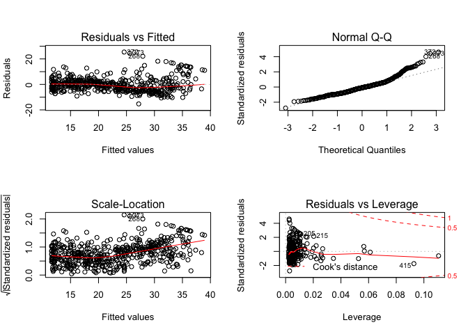
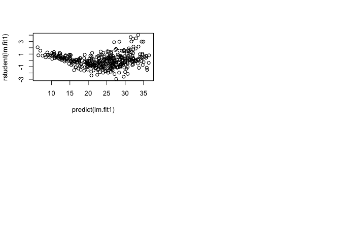
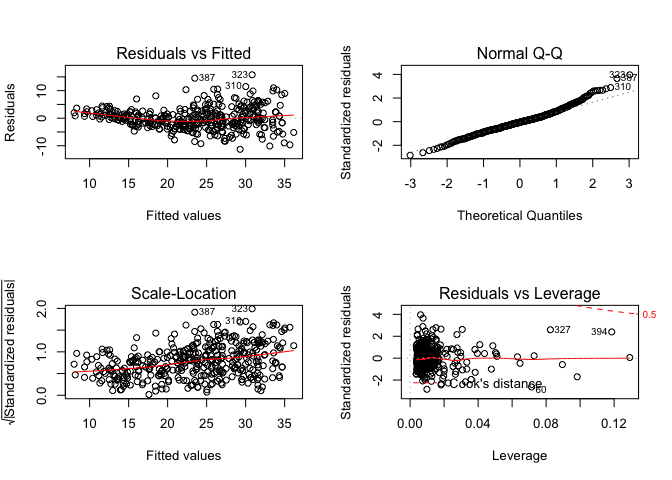
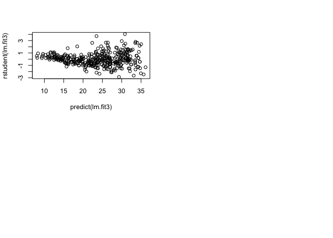
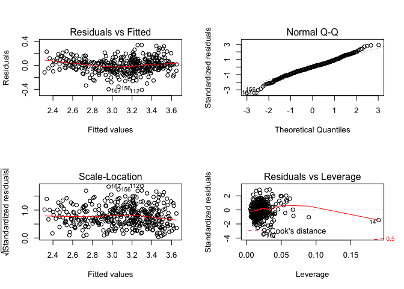
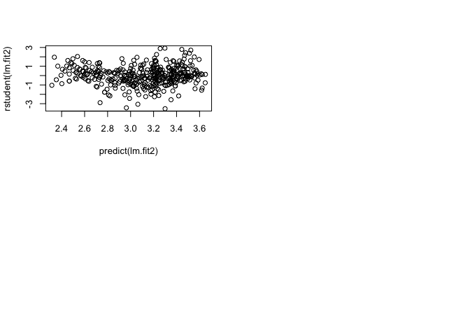
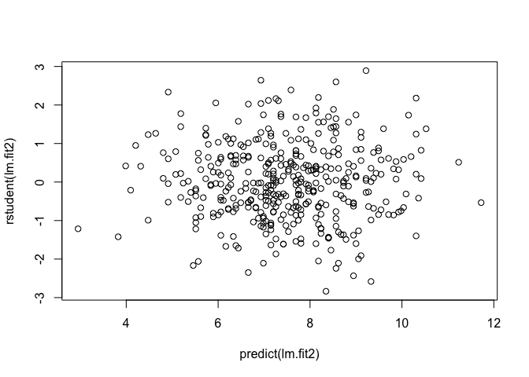

# Chapter3_Dec_20


#3.6.3 Multiple Linear Regression


```r
library (MASS)
library (ISLR)
```

```
## Warning: package 'ISLR' was built under R version 3.4.2
```

```r
lm.fit <- lm(data = Boston, medv~lstat+age)
summary(lm.fit)
```

```
## 
## Call:
## lm(formula = medv ~ lstat + age, data = Boston)
## 
## Residuals:
##     Min      1Q  Median      3Q     Max 
## -15.981  -3.978  -1.283   1.968  23.158 
## 
## Coefficients:
##             Estimate Std. Error t value Pr(>|t|)    
## (Intercept) 33.22276    0.73085  45.458  < 2e-16 ***
## lstat       -1.03207    0.04819 -21.416  < 2e-16 ***
## age          0.03454    0.01223   2.826  0.00491 ** 
## ---
## Signif. codes:  0 '***' 0.001 '**' 0.01 '*' 0.05 '.' 0.1 ' ' 1
## 
## Residual standard error: 6.173 on 503 degrees of freedom
## Multiple R-squared:  0.5513,	Adjusted R-squared:  0.5495 
## F-statistic:   309 on 2 and 503 DF,  p-value: < 2.2e-16
```
#for see all variables


```r
lm.fit <- lm(medv~. , data=Boston)
summary(lm.fit)
```

```
## 
## Call:
## lm(formula = medv ~ ., data = Boston)
## 
## Residuals:
##     Min      1Q  Median      3Q     Max 
## -15.595  -2.730  -0.518   1.777  26.199 
## 
## Coefficients:
##               Estimate Std. Error t value Pr(>|t|)    
## (Intercept)  3.646e+01  5.103e+00   7.144 3.28e-12 ***
## crim        -1.080e-01  3.286e-02  -3.287 0.001087 ** 
## zn           4.642e-02  1.373e-02   3.382 0.000778 ***
## indus        2.056e-02  6.150e-02   0.334 0.738288    
## chas         2.687e+00  8.616e-01   3.118 0.001925 ** 
## nox         -1.777e+01  3.820e+00  -4.651 4.25e-06 ***
## rm           3.810e+00  4.179e-01   9.116  < 2e-16 ***
## age          6.922e-04  1.321e-02   0.052 0.958229    
## dis         -1.476e+00  1.995e-01  -7.398 6.01e-13 ***
## rad          3.060e-01  6.635e-02   4.613 5.07e-06 ***
## tax         -1.233e-02  3.760e-03  -3.280 0.001112 ** 
## ptratio     -9.527e-01  1.308e-01  -7.283 1.31e-12 ***
## black        9.312e-03  2.686e-03   3.467 0.000573 ***
## lstat       -5.248e-01  5.072e-02 -10.347  < 2e-16 ***
## ---
## Signif. codes:  0 '***' 0.001 '**' 0.01 '*' 0.05 '.' 0.1 ' ' 1
## 
## Residual standard error: 4.745 on 492 degrees of freedom
## Multiple R-squared:  0.7406,	Adjusted R-squared:  0.7338 
## F-statistic: 108.1 on 13 and 492 DF,  p-value: < 2.2e-16
```

```r
summary(lm.fit)$r.sq
```

```
## [1] 0.7406427
```

```r
#summary(lm.fit)$sigma gives us the RSE
summary(lm.fit)$sigma
```

```
## [1] 4.745298
```


```r
#install.packages("car")
library (car)
```

```
## Warning: package 'car' was built under R version 3.4.3
```

```r
vif(lm.fit)
```

```
##     crim       zn    indus     chas      nox       rm      age      dis 
## 1.792192 2.298758 3.991596 1.073995 4.393720 1.933744 3.100826 3.955945 
##      rad      tax  ptratio    black    lstat 
## 7.484496 9.008554 1.799084 1.348521 2.941491
```

```r
#all variables except age

lm.fit1=lm(medv~.-age, data = Boston)
summary (lm.fit1)
```

```
## 
## Call:
## lm(formula = medv ~ . - age, data = Boston)
## 
## Residuals:
##      Min       1Q   Median       3Q      Max 
## -15.6054  -2.7313  -0.5188   1.7601  26.2243 
## 
## Coefficients:
##               Estimate Std. Error t value Pr(>|t|)    
## (Intercept)  36.436927   5.080119   7.172 2.72e-12 ***
## crim         -0.108006   0.032832  -3.290 0.001075 ** 
## zn            0.046334   0.013613   3.404 0.000719 ***
## indus         0.020562   0.061433   0.335 0.737989    
## chas          2.689026   0.859598   3.128 0.001863 ** 
## nox         -17.713540   3.679308  -4.814 1.97e-06 ***
## rm            3.814394   0.408480   9.338  < 2e-16 ***
## dis          -1.478612   0.190611  -7.757 5.03e-14 ***
## rad           0.305786   0.066089   4.627 4.75e-06 ***
## tax          -0.012329   0.003755  -3.283 0.001099 ** 
## ptratio      -0.952211   0.130294  -7.308 1.10e-12 ***
## black         0.009321   0.002678   3.481 0.000544 ***
## lstat        -0.523852   0.047625 -10.999  < 2e-16 ***
## ---
## Signif. codes:  0 '***' 0.001 '**' 0.01 '*' 0.05 '.' 0.1 ' ' 1
## 
## Residual standard error: 4.74 on 493 degrees of freedom
## Multiple R-squared:  0.7406,	Adjusted R-squared:  0.7343 
## F-statistic: 117.3 on 12 and 493 DF,  p-value: < 2.2e-16
```

```r
lm.fit1=update(lm.fit, ~. -age)
```

#3.6.4 Interaction Terms

#3.6.5 Non-linear Transformations of the Predictors


```r
lm.fit2=lm(medv~lstat +I(lstat^2), data = Boston)
summary(lm.fit2)
```

```
## 
## Call:
## lm(formula = medv ~ lstat + I(lstat^2), data = Boston)
## 
## Residuals:
##      Min       1Q   Median       3Q      Max 
## -15.2834  -3.8313  -0.5295   2.3095  25.4148 
## 
## Coefficients:
##              Estimate Std. Error t value Pr(>|t|)    
## (Intercept) 42.862007   0.872084   49.15   <2e-16 ***
## lstat       -2.332821   0.123803  -18.84   <2e-16 ***
## I(lstat^2)   0.043547   0.003745   11.63   <2e-16 ***
## ---
## Signif. codes:  0 '***' 0.001 '**' 0.01 '*' 0.05 '.' 0.1 ' ' 1
## 
## Residual standard error: 5.524 on 503 degrees of freedom
## Multiple R-squared:  0.6407,	Adjusted R-squared:  0.6393 
## F-statistic: 448.5 on 2 and 503 DF,  p-value: < 2.2e-16
```

```r
lm.fit=lm(medv~lstat, data=Boston)
anova(lm.fit ,lm.fit2) #we can see the lm.fit2 fitted better based on F test
```

```
## Analysis of Variance Table
## 
## Model 1: medv ~ lstat
## Model 2: medv ~ lstat + I(lstat^2)
##   Res.Df   RSS Df Sum of Sq     F    Pr(>F)    
## 1    504 19472                                 
## 2    503 15347  1    4125.1 135.2 < 2.2e-16 ***
## ---
## Signif. codes:  0 '***' 0.001 '**' 0.01 '*' 0.05 '.' 0.1 ' ' 1
```

```r
par(mfrow=c(2,2))
plot(lm.fit2)
```

<!-- -->

```r
#for checking the polynominal
lm.fit5=lm(medv~ poly(lstat, 5), data = Boston) #fifth order fitted better
summary(lm.fit5)
```

```
## 
## Call:
## lm(formula = medv ~ poly(lstat, 5), data = Boston)
## 
## Residuals:
##      Min       1Q   Median       3Q      Max 
## -13.5433  -3.1039  -0.7052   2.0844  27.1153 
## 
## Coefficients:
##                  Estimate Std. Error t value Pr(>|t|)    
## (Intercept)       22.5328     0.2318  97.197  < 2e-16 ***
## poly(lstat, 5)1 -152.4595     5.2148 -29.236  < 2e-16 ***
## poly(lstat, 5)2   64.2272     5.2148  12.316  < 2e-16 ***
## poly(lstat, 5)3  -27.0511     5.2148  -5.187 3.10e-07 ***
## poly(lstat, 5)4   25.4517     5.2148   4.881 1.42e-06 ***
## poly(lstat, 5)5  -19.2524     5.2148  -3.692 0.000247 ***
## ---
## Signif. codes:  0 '***' 0.001 '**' 0.01 '*' 0.05 '.' 0.1 ' ' 1
## 
## Residual standard error: 5.215 on 500 degrees of freedom
## Multiple R-squared:  0.6817,	Adjusted R-squared:  0.6785 
## F-statistic: 214.2 on 5 and 500 DF,  p-value: < 2.2e-16
```

```r
summary(lm(medv~log(rm), data = Boston))
```

```
## 
## Call:
## lm(formula = medv ~ log(rm), data = Boston)
## 
## Residuals:
##     Min      1Q  Median      3Q     Max 
## -19.487  -2.875  -0.104   2.837  39.816 
## 
## Coefficients:
##             Estimate Std. Error t value Pr(>|t|)    
## (Intercept)  -76.488      5.028  -15.21   <2e-16 ***
## log(rm)       54.055      2.739   19.73   <2e-16 ***
## ---
## Signif. codes:  0 '***' 0.001 '**' 0.01 '*' 0.05 '.' 0.1 ' ' 1
## 
## Residual standard error: 6.915 on 504 degrees of freedom
## Multiple R-squared:  0.4358,	Adjusted R-squared:  0.4347 
## F-statistic: 389.3 on 1 and 504 DF,  p-value: < 2.2e-16
```

#3.6.6 Qualitative Predictors


```r
fix( Carseats )
names(Carseats )
```

```
##  [1] "Sales"       "CompPrice"   "Income"      "Advertising" "Population" 
##  [6] "Price"       "ShelveLoc"   "Age"         "Education"   "Urban"      
## [11] "US"
```

#problem

2. Carefully explain the differences between the KNN classifier and KNN
regression methods.

The result of KNN classifier is the classification output for Y (qualitative), while other output for a KNN regression predicts the
quantitative value for f(X). both related in formula.

3.Suppose we have a data set with five predictors, X1 =GPA, X2 = IQ,
X3 = Gender (1 for Female and 0 for Male), X4 = Interaction between
GPA and IQ, and X5 = Interaction between GPA and Gender. The
response is starting salary after graduation (in thousands of dollars).
Suppose we use least squares to fit the model, and get ˆβ0 = 50, ˆβ1 =
20, ˆβ2 = 0.07, ˆβ3 = 35, ˆβ4 = 0.01, ˆβ5 = −10.
(a) Which answer is correct, and why?
i. For a fixed value of IQ and GPA, males earn more on average
than females.
 
ii. For a fixed value of IQ and GPA, females earn more on
average than males.
iii. For a fixed value of IQ and GPA, males earn more on average
than females provided that the GPA is high enough.
iv. For a fixed value of IQ and GPA, females earn more on
average than males provided that the GPA is high enough.

answer:
Y = 50 + 20(gpa) + 0.07(iq) + 35(gender) + 0.01(gpa * iq) - 10 (gpa * gender)
suppose : gpa l1 iq l2
(a) Y = 50 + 20 l1 + 0.07 l2 + 35 gender + 0.01(l1 * l2) - 10 (l1 * gender)
male: (gender = 0)   50 + 20 l1 + 0.07 l2 + 0.01(l1 * l2)
female: (gender = 1) 50 + 20 l1 + 0.07 l2 + 35 + 0.01(l1 * l2) - 10 (l1)

iii. Once the GPA is high enough, males earn more on average.

(b) Predict the salary of a female with IQ of 110 and a GPA of 4.0.

answer:
(b) Y(Gender = 1, IQ = 110, GPA = 4.0)
= 50 + 20 * 4 + 0.07 * 110 + 35 + 0.01 (4 * 110) - 10 * 4
= 137.1

(c) True or false: Since the coefficient for the GPA/IQ interaction
term is very small, there is very little evidence of an interaction
effect. Justify your answer.

answer:
(c) False. We must examine the p-value of the regression coefficient to
understand whether the interaction term is statistically significant or not.

9. This question involves the use of multiple linear regression on the
Auto data set

(d) Use the plot() function to produce diagnostic plots of the linear
regression fit. Comment on any problems you see with the fit.
Do the residual plots suggest any unusually large outliers? Does
the leverage plot identify any observations with unusually high
leverage?


```r
library (MASS)
library (ISLR)
data(Auto)
lm.fit1 = lm(mpg~.-name, data=Auto)
summary(lm.fit1)
```

```
## 
## Call:
## lm(formula = mpg ~ . - name, data = Auto)
## 
## Residuals:
##     Min      1Q  Median      3Q     Max 
## -9.5903 -2.1565 -0.1169  1.8690 13.0604 
## 
## Coefficients:
##                Estimate Std. Error t value Pr(>|t|)    
## (Intercept)  -17.218435   4.644294  -3.707  0.00024 ***
## cylinders     -0.493376   0.323282  -1.526  0.12780    
## displacement   0.019896   0.007515   2.647  0.00844 ** 
## horsepower    -0.016951   0.013787  -1.230  0.21963    
## weight        -0.006474   0.000652  -9.929  < 2e-16 ***
## acceleration   0.080576   0.098845   0.815  0.41548    
## year           0.750773   0.050973  14.729  < 2e-16 ***
## origin         1.426141   0.278136   5.127 4.67e-07 ***
## ---
## Signif. codes:  0 '***' 0.001 '**' 0.01 '*' 0.05 '.' 0.1 ' ' 1
## 
## Residual standard error: 3.328 on 384 degrees of freedom
## Multiple R-squared:  0.8215,	Adjusted R-squared:  0.8182 
## F-statistic: 252.4 on 7 and 384 DF,  p-value: < 2.2e-16
```

```r
par(mfrow=c(2,2))
plot(lm.fit1)
```

<!-- -->

```r
#The fit does not appear to be accurate because there is an obvious curve pattern to the residuals plots. From the leverage plot, point 14 appears to have high leverage, without a high magnitude residual.

plot(predict(lm.fit1), rstudent(lm.fit1))

#There are possible outliers regarding  plot of studentized residuals because there are data with a value greater than 3.
```

<!-- -->

(e) Use the * and : symbols to fit linear regression models with
interaction effects. Do any interactions appear to be statistically
significant?


```r
lm.fit2 = lm(mpg~cylinders*displacement+displacement*weight, data = Auto)
summary(lm.fit2)
```

```
## 
## Call:
## lm(formula = mpg ~ cylinders * displacement + displacement * 
##     weight, data = Auto)
## 
## Residuals:
##      Min       1Q   Median       3Q      Max 
## -13.2934  -2.5184  -0.3476   1.8399  17.7723 
## 
## Coefficients:
##                          Estimate Std. Error t value Pr(>|t|)    
## (Intercept)             5.262e+01  2.237e+00  23.519  < 2e-16 ***
## cylinders               7.606e-01  7.669e-01   0.992    0.322    
## displacement           -7.351e-02  1.669e-02  -4.403 1.38e-05 ***
## weight                 -9.888e-03  1.329e-03  -7.438 6.69e-13 ***
## cylinders:displacement -2.986e-03  3.426e-03  -0.872    0.384    
## displacement:weight     2.128e-05  5.002e-06   4.254 2.64e-05 ***
## ---
## Signif. codes:  0 '***' 0.001 '**' 0.01 '*' 0.05 '.' 0.1 ' ' 1
## 
## Residual standard error: 4.103 on 386 degrees of freedom
## Multiple R-squared:  0.7272,	Adjusted R-squared:  0.7237 
## F-statistic: 205.8 on 5 and 386 DF,  p-value: < 2.2e-16
```

```r
#picked two highest correlation pairs from correlation matrix.From the p-values, we can see that the interaction between displacement and weight is statistically signifcant, while the interactiion between cylinders and displacement is not.
```

(f) Try a few different transformations of the variables, such as
log(X),√X, X2. Comment on your findings.


```r
lm.fit3 = lm(mpg~log(weight)+sqrt(horsepower)+acceleration+I(acceleration^2), data = Auto)
summary(lm.fit3)
```

```
## 
## Call:
## lm(formula = mpg ~ log(weight) + sqrt(horsepower) + acceleration + 
##     I(acceleration^2), data = Auto)
## 
## Residuals:
##      Min       1Q   Median       3Q      Max 
## -11.2932  -2.5082  -0.2237   2.0237  15.7650 
## 
## Coefficients:
##                    Estimate Std. Error t value Pr(>|t|)    
## (Intercept)       178.30303   10.80451  16.503  < 2e-16 ***
## log(weight)       -14.74259    1.73994  -8.473 5.06e-16 ***
## sqrt(horsepower)   -1.85192    0.36005  -5.144 4.29e-07 ***
## acceleration       -2.19890    0.63903  -3.441 0.000643 ***
## I(acceleration^2)   0.06139    0.01857   3.305 0.001037 ** 
## ---
## Signif. codes:  0 '***' 0.001 '**' 0.01 '*' 0.05 '.' 0.1 ' ' 1
## 
## Residual standard error: 3.99 on 387 degrees of freedom
## Multiple R-squared:  0.7414,	Adjusted R-squared:  0.7387 
## F-statistic: 277.3 on 4 and 387 DF,  p-value: < 2.2e-16
```

```r
par(mfrow=c(2,2))
plot(lm.fit3)
```

<!-- -->

```r
plot(predict(lm.fit3), rstudent(lm.fit3))

#from the p-values, the log(weight), sqrt(horsepower), and acceleration^2 all have statistical significance. The residuals plot has less of a obvious pattern than the plot of all linear regression terms. The studentized residuals displays potential outliers (>3). The leverage plot indicates more than three points with high leverage.
#The Q-Q plot indicates somewhat unnormality of the residuals. So, a better transformation need to be applied to our model.So in the next attempt, we use log(mpg) as our response variable.


lm.fit2<-lm(log(mpg)~cylinders+displacement+horsepower+weight+acceleration+year+origin,data=Auto)
summary(lm.fit2)
```

```
## 
## Call:
## lm(formula = log(mpg) ~ cylinders + displacement + horsepower + 
##     weight + acceleration + year + origin, data = Auto)
## 
## Residuals:
##      Min       1Q   Median       3Q      Max 
## -0.40955 -0.06533  0.00079  0.06785  0.33925 
## 
## Coefficients:
##                Estimate Std. Error t value Pr(>|t|)    
## (Intercept)   1.751e+00  1.662e-01  10.533  < 2e-16 ***
## cylinders    -2.795e-02  1.157e-02  -2.415  0.01619 *  
## displacement  6.362e-04  2.690e-04   2.365  0.01852 *  
## horsepower   -1.475e-03  4.935e-04  -2.989  0.00298 ** 
## weight       -2.551e-04  2.334e-05 -10.931  < 2e-16 ***
## acceleration -1.348e-03  3.538e-03  -0.381  0.70339    
## year          2.958e-02  1.824e-03  16.211  < 2e-16 ***
## origin        4.071e-02  9.955e-03   4.089 5.28e-05 ***
## ---
## Signif. codes:  0 '***' 0.001 '**' 0.01 '*' 0.05 '.' 0.1 ' ' 1
## 
## Residual standard error: 0.1191 on 384 degrees of freedom
## Multiple R-squared:  0.8795,	Adjusted R-squared:  0.8773 
## F-statistic: 400.4 on 7 and 384 DF,  p-value: < 2.2e-16
```

```r
par(mfrow=c(2,2)) 
```

<!-- -->

```r
plot(lm.fit2)
```

<!-- -->

```r
plot(predict(lm.fit2),rstudent(lm.fit2))

#The outputs show that log transform of mpg yield better model fitting regarding better R^2, normality of residuals).
```

<!-- -->

10. This question should be answered using the Carseats data set.
(h) Is there evidence of outliers or high leverage observations in the
model from (e)?


```r
library(ISLR)
summary(Carseats)
```

```
##      Sales          CompPrice       Income        Advertising    
##  Min.   : 0.000   Min.   : 77   Min.   : 21.00   Min.   : 0.000  
##  1st Qu.: 5.390   1st Qu.:115   1st Qu.: 42.75   1st Qu.: 0.000  
##  Median : 7.490   Median :125   Median : 69.00   Median : 5.000  
##  Mean   : 7.496   Mean   :125   Mean   : 68.66   Mean   : 6.635  
##  3rd Qu.: 9.320   3rd Qu.:135   3rd Qu.: 91.00   3rd Qu.:12.000  
##  Max.   :16.270   Max.   :175   Max.   :120.00   Max.   :29.000  
##    Population        Price        ShelveLoc        Age       
##  Min.   : 10.0   Min.   : 24.0   Bad   : 96   Min.   :25.00  
##  1st Qu.:139.0   1st Qu.:100.0   Good  : 85   1st Qu.:39.75  
##  Median :272.0   Median :117.0   Medium:219   Median :54.50  
##  Mean   :264.8   Mean   :115.8                Mean   :53.32  
##  3rd Qu.:398.5   3rd Qu.:131.0                3rd Qu.:66.00  
##  Max.   :509.0   Max.   :191.0                Max.   :80.00  
##    Education    Urban       US     
##  Min.   :10.0   No :118   No :142  
##  1st Qu.:12.0   Yes:282   Yes:258  
##  Median :14.0                      
##  Mean   :13.9                      
##  3rd Qu.:16.0                      
##  Max.   :18.0
```

```r
lm.fit2 = lm(Sales ~ Price + US, data = Carseats)
summary(lm.fit2)
```

```
## 
## Call:
## lm(formula = Sales ~ Price + US, data = Carseats)
## 
## Residuals:
##     Min      1Q  Median      3Q     Max 
## -6.9269 -1.6286 -0.0574  1.5766  7.0515 
## 
## Coefficients:
##             Estimate Std. Error t value Pr(>|t|)    
## (Intercept) 13.03079    0.63098  20.652  < 2e-16 ***
## Price       -0.05448    0.00523 -10.416  < 2e-16 ***
## USYes        1.19964    0.25846   4.641 4.71e-06 ***
## ---
## Signif. codes:  0 '***' 0.001 '**' 0.01 '*' 0.05 '.' 0.1 ' ' 1
## 
## Residual standard error: 2.469 on 397 degrees of freedom
## Multiple R-squared:  0.2393,	Adjusted R-squared:  0.2354 
## F-statistic: 62.43 on 2 and 397 DF,  p-value: < 2.2e-16
```

```r
plot(predict(lm.fit2), rstudent(lm.fit2))
```

<!-- -->

```r
#All studentized residuals appear to be bounded by -3 to 3, so not outliers 

par(mfrow=c(2,2))
plot(lm.fit2)
```

<!-- -->

```r
#There are a few observations that greatly exceed $(p+1)/n$ (r 3/397) on the leverage-statistic plot that suggest that the corresponding points have high leverage.
```

14. This problem focuses on the collinearity problem.
(a) Perform the following commands in R:
The last line corresponds to creating a linear model in which y is
a function of x1 and x2. Write out the form of the linear model.
What are the regression coefficients?


```r
set.seed (1)
x1=runif (100)
x2 =0.5* x1+rnorm (100) /10
y=2+2* x1 +0.3* x2+rnorm (100)
#Y = 2 + 2 X_1 + 0.3 X_2 + \epsilon beta_0 = 2, beta_1 = 2, beta_2 = 0.3 
```

(b) What is the correlation between x1 and x2? Create a scatterplot
displaying the relationship between the variables.


```r
cor(x1, x2)
```

```
## [1] 0.8351212
```

```r
plot(x1, x2)
```

<!-- -->

(c) Using this data, fit a least squares regression to predict y using
x1 and x2. Describe the results obtained. What are ˆ β0, ˆ β1, and
ˆ β2? How do these relate to the true β0, β1, and β2? Can you
reject the null hypothesis H0 : β1 = 0? How about the null
hypothesis H0 : β2 = 0?


```r
lm.fit = lm(y~x1+x2)
summary(lm.fit)
```

```
## 
## Call:
## lm(formula = y ~ x1 + x2)
## 
## Residuals:
##     Min      1Q  Median      3Q     Max 
## -2.8311 -0.7273 -0.0537  0.6338  2.3359 
## 
## Coefficients:
##             Estimate Std. Error t value Pr(>|t|)    
## (Intercept)   2.1305     0.2319   9.188 7.61e-15 ***
## x1            1.4396     0.7212   1.996   0.0487 *  
## x2            1.0097     1.1337   0.891   0.3754    
## ---
## Signif. codes:  0 '***' 0.001 '**' 0.01 '*' 0.05 '.' 0.1 ' ' 1
## 
## Residual standard error: 1.056 on 97 degrees of freedom
## Multiple R-squared:  0.2088,	Adjusted R-squared:  0.1925 
## F-statistic:  12.8 on 2 and 97 DF,  p-value: 1.164e-05
```

```r
#beta_0 = 2.1305 , beta_1 = 1.4396, beta_2 = 1.0097
# We can reject the null hypothesis for beta_1 because its p-value is below 5%. We cannot reject the null hypothesis for beta_2 because its p-value is much above the 5%
```
(d) Now fit a least squares regression to predict y using only x1.
Comment on your results. Can you reject the null hypothesis
H0 : β1 = 0?


```r
lm.fit = lm(y~x1)
summary(lm.fit)
```

```
## 
## Call:
## lm(formula = y ~ x1)
## 
## Residuals:
##      Min       1Q   Median       3Q      Max 
## -2.89495 -0.66874 -0.07785  0.59221  2.45560 
## 
## Coefficients:
##             Estimate Std. Error t value Pr(>|t|)    
## (Intercept)   2.1124     0.2307   9.155 8.27e-15 ***
## x1            1.9759     0.3963   4.986 2.66e-06 ***
## ---
## Signif. codes:  0 '***' 0.001 '**' 0.01 '*' 0.05 '.' 0.1 ' ' 1
## 
## Residual standard error: 1.055 on 98 degrees of freedom
## Multiple R-squared:  0.2024,	Adjusted R-squared:  0.1942 
## F-statistic: 24.86 on 1 and 98 DF,  p-value: 2.661e-06
```

```r
#Yes, we can reject the null hypothesis for the regression coefficient given the p-value for its t-statistic is near zero.
```

(e) Now fit a least squares regression to predict y using only x2.
Comment on your results. Can you reject the null hypothesis
H0 : β1 = 0?


```r
lm.fit = lm(y~x2)
summary(lm.fit)
```

```
## 
## Call:
## lm(formula = y ~ x2)
## 
## Residuals:
##      Min       1Q   Median       3Q      Max 
## -2.62687 -0.75156 -0.03598  0.72383  2.44890 
## 
## Coefficients:
##             Estimate Std. Error t value Pr(>|t|)    
## (Intercept)   2.3899     0.1949   12.26  < 2e-16 ***
## x2            2.8996     0.6330    4.58 1.37e-05 ***
## ---
## Signif. codes:  0 '***' 0.001 '**' 0.01 '*' 0.05 '.' 0.1 ' ' 1
## 
## Residual standard error: 1.072 on 98 degrees of freedom
## Multiple R-squared:  0.1763,	Adjusted R-squared:  0.1679 
## F-statistic: 20.98 on 1 and 98 DF,  p-value: 1.366e-05
```

```r
#Yes, we can reject the null hypothesis for the regression coefficient given the p-value for its t-statistic is near zero.
```
(f) Do the results obtained in (c)–(e) contradict each other? Explain
your answer.

No, because x1 and x2 have collinearity, it is hard to distinguish their effects when regressed upon together.

(g) Now suppose we obtain one additional observation, which was
unfortunately mismeasured.
> x1=c(x1 , 0.1)
> x2=c(x2 , 0.8)
> y=c(y,6)

Re-fit the linear models from (c) to (e) using this new data. What
effect does this new observation have on the each of the models?
In each model, is this observation an outlier? A high-leverage
point? Both? Explain your answers.

