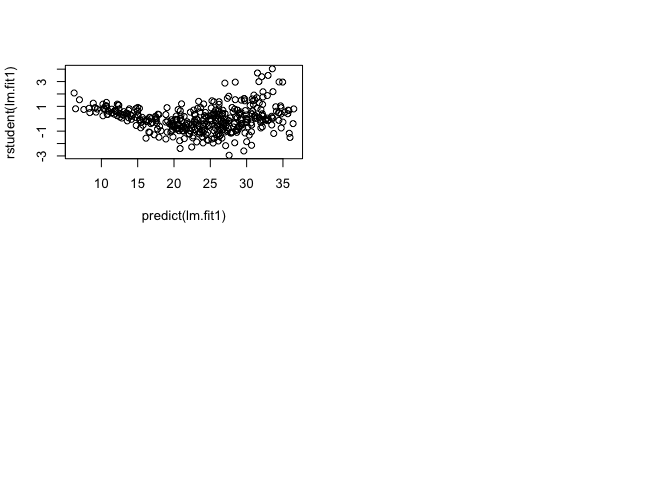
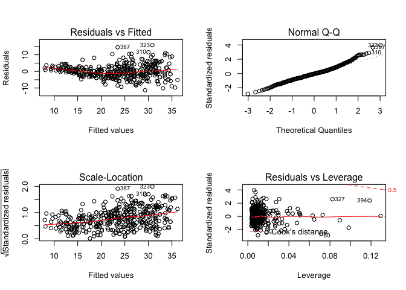
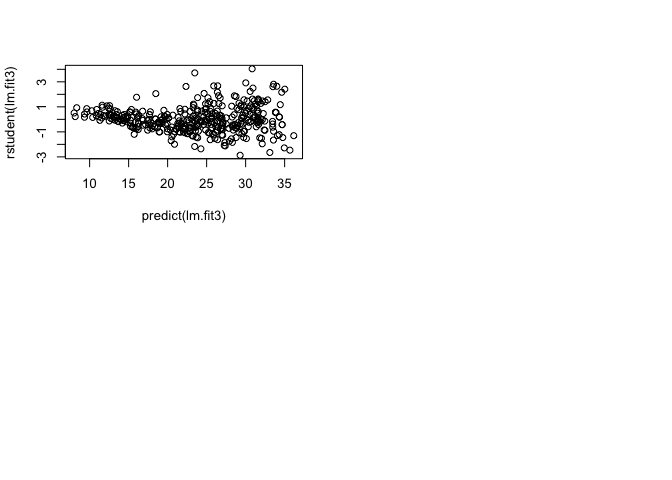
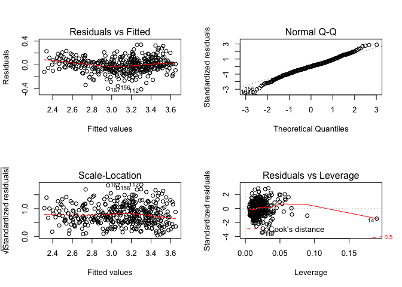
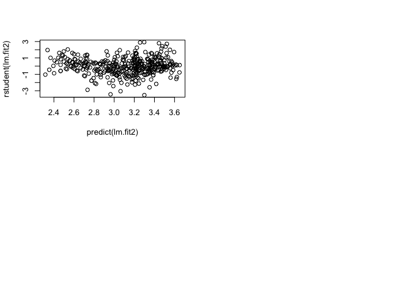
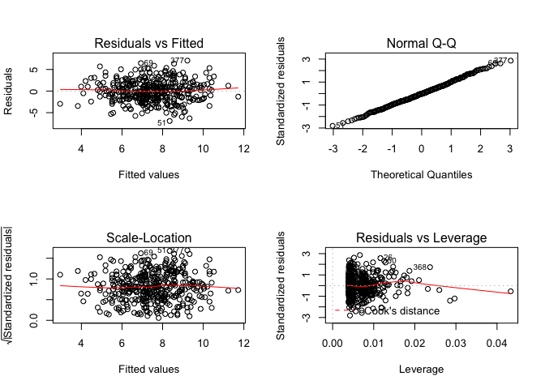

# Chapter3_Dec_20


#problem

2. Carefully explain the differences between the KNN classifier and KNN
regression methods.

The result of KNN classifier is the classification output for Y (qualitative), while ther output for a KNN regression predicts the
quantitative value for f(X). both related in formula.

3.Suppose we have a data set with five predictors, X1 =GPA, X2 = IQ,
X3 = Gender (1 for Female and 0 for Male), X4 = Interaction between
GPA and IQ, and X5 = Interaction between GPA and Gender. The
response is starting salary after graduation (in thousands of dollars).
Suppose we use least squares to fit the model, and get ˆβ0 = 50, ˆβ1 =
20, ˆβ2 = 0.07, ˆβ3 = 35, ˆβ4 = 0.01, ˆβ5 = −10.
(a) Which answer is correct, and why?
i. For a fixed value of IQ and GPA, males earn more on average
than females.
 
ii. For a fixed value of IQ and GPA, females earn more on
average than males.
iii. For a fixed value of IQ and GPA, males earn more on average
than females provided that the GPA is high enough.
iv. For a fixed value of IQ and GPA, females earn more on
average than males provided that the GPA is high enough.

answer:
Y = 50 + 20(gpa) + 0.07(iq) + 35(gender) + 0.01(gpa * iq) - 10 (gpa * gender)
suppose : gpa l1 iq l2
(a) Y = 50 + 20 l1 + 0.07 l2 + 35 gender + 0.01(l1 * l2) - 10 (l1 * gender)
male: (gender = 0)   50 + 20 l1 + 0.07 l2 + 0.01(l1 * l2)
female: (gender = 1) 50 + 20 l1 + 0.07 l2 + 35 + 0.01(l1 * l2) - 10 (l1)

iii. Once the GPA is high enough, males earn more on average.

(b) Predict the salary of a female with IQ of 110 and a GPA of 4.0.

answer:
(b) Y(Gender = 1, IQ = 110, GPA = 4.0)
= 50 + 20 * 4 + 0.07 * 110 + 35 + 0.01 (4 * 110) - 10 * 4
= 137.1

(c) True or false: Since the coefficient for the GPA/IQ interaction
term is very small, there is very little evidence of an interaction
effect. Justify your answer.

answer:
(c) False. We must examine the p-value of the regression coefficient to
understand whether the interaction term is statistically significant or not.

9. This question involves the use of multiple linear regression on the
Auto data set

(d) Use the plot() function to produce diagnostic plots of the linear
regression fit. Comment on any problems you see with the fit.
Do the residual plots suggest any unusually large outliers? Does
the leverage plot identify any observations with unusually high
leverage?


```r
library (MASS)
library (ISLR)
```

```
## Warning: package 'ISLR' was built under R version 3.4.2
```

```r
data(Auto)
lm.fit1 = lm(mpg~.-name, data=Auto)
summary(lm.fit1)
```

```
## 
## Call:
## lm(formula = mpg ~ . - name, data = Auto)
## 
## Residuals:
##     Min      1Q  Median      3Q     Max 
## -9.5903 -2.1565 -0.1169  1.8690 13.0604 
## 
## Coefficients:
##                Estimate Std. Error t value Pr(>|t|)    
## (Intercept)  -17.218435   4.644294  -3.707  0.00024 ***
## cylinders     -0.493376   0.323282  -1.526  0.12780    
## displacement   0.019896   0.007515   2.647  0.00844 ** 
## horsepower    -0.016951   0.013787  -1.230  0.21963    
## weight        -0.006474   0.000652  -9.929  < 2e-16 ***
## acceleration   0.080576   0.098845   0.815  0.41548    
## year           0.750773   0.050973  14.729  < 2e-16 ***
## origin         1.426141   0.278136   5.127 4.67e-07 ***
## ---
## Signif. codes:  0 '***' 0.001 '**' 0.01 '*' 0.05 '.' 0.1 ' ' 1
## 
## Residual standard error: 3.328 on 384 degrees of freedom
## Multiple R-squared:  0.8215,	Adjusted R-squared:  0.8182 
## F-statistic: 252.4 on 7 and 384 DF,  p-value: < 2.2e-16
```

```r
par(mfrow=c(2,2))
plot(lm.fit1)
```

<!-- -->

```r
#The fit does not appear to be accurate because there is an obvious curve pattern to the residuals plots. From the leverage plot, point 14 appears to have high leverage, without a high magnitude residual.

plot(predict(lm.fit1), rstudent(lm.fit1))

#There are possible outliers regarding  plot of studentized residuals because there are data with a value greater than 3.
```

<!-- -->

(e) Use the * and : symbols to fit linear regression models with
interaction effects. Do any interactions appear to be statistically
significant?


```r
lm.fit2 = lm(mpg~cylinders*displacement+displacement*weight, data = Auto)
summary(lm.fit2)
```

```
## 
## Call:
## lm(formula = mpg ~ cylinders * displacement + displacement * 
##     weight, data = Auto)
## 
## Residuals:
##      Min       1Q   Median       3Q      Max 
## -13.2934  -2.5184  -0.3476   1.8399  17.7723 
## 
## Coefficients:
##                          Estimate Std. Error t value Pr(>|t|)    
## (Intercept)             5.262e+01  2.237e+00  23.519  < 2e-16 ***
## cylinders               7.606e-01  7.669e-01   0.992    0.322    
## displacement           -7.351e-02  1.669e-02  -4.403 1.38e-05 ***
## weight                 -9.888e-03  1.329e-03  -7.438 6.69e-13 ***
## cylinders:displacement -2.986e-03  3.426e-03  -0.872    0.384    
## displacement:weight     2.128e-05  5.002e-06   4.254 2.64e-05 ***
## ---
## Signif. codes:  0 '***' 0.001 '**' 0.01 '*' 0.05 '.' 0.1 ' ' 1
## 
## Residual standard error: 4.103 on 386 degrees of freedom
## Multiple R-squared:  0.7272,	Adjusted R-squared:  0.7237 
## F-statistic: 205.8 on 5 and 386 DF,  p-value: < 2.2e-16
```

```r
#picked two highest correlation pairs from correlation matrix.From the p-values, we can see that the interaction between displacement and weight is statistically signifcant, while the interactiion between cylinders and displacement is not.
```

(f) Try a few different transformations of the variables, such as
log(X),√X, X2. Comment on your findings.


```r
lm.fit3 = lm(mpg~log(weight)+sqrt(horsepower)+acceleration+I(acceleration^2), data = Auto)
summary(lm.fit3)
```

```
## 
## Call:
## lm(formula = mpg ~ log(weight) + sqrt(horsepower) + acceleration + 
##     I(acceleration^2), data = Auto)
## 
## Residuals:
##      Min       1Q   Median       3Q      Max 
## -11.2932  -2.5082  -0.2237   2.0237  15.7650 
## 
## Coefficients:
##                    Estimate Std. Error t value Pr(>|t|)    
## (Intercept)       178.30303   10.80451  16.503  < 2e-16 ***
## log(weight)       -14.74259    1.73994  -8.473 5.06e-16 ***
## sqrt(horsepower)   -1.85192    0.36005  -5.144 4.29e-07 ***
## acceleration       -2.19890    0.63903  -3.441 0.000643 ***
## I(acceleration^2)   0.06139    0.01857   3.305 0.001037 ** 
## ---
## Signif. codes:  0 '***' 0.001 '**' 0.01 '*' 0.05 '.' 0.1 ' ' 1
## 
## Residual standard error: 3.99 on 387 degrees of freedom
## Multiple R-squared:  0.7414,	Adjusted R-squared:  0.7387 
## F-statistic: 277.3 on 4 and 387 DF,  p-value: < 2.2e-16
```

```r
par(mfrow=c(2,2))
plot(lm.fit3)
```

<!-- -->

```r
plot(predict(lm.fit3), rstudent(lm.fit3))

#from the p-values, the log(weight), sqrt(horsepower), and acceleration^2 all have statistical significance. The residuals plot has less of a obvious pattern than the plot of all linear regression terms. The studentized residuals displays potential outliers (>3). The leverage plot indicates more than three points with high leverage.
#The Q-Q plot indicates somewhat unnormality of the residuals. So, a better transformation need to be applied to our model.So in the next attempt, we use log(mpg) as our response variable.


lm.fit2<-lm(log(mpg)~cylinders+displacement+horsepower+weight+acceleration+year+origin,data=Auto)
summary(lm.fit2)
```

```
## 
## Call:
## lm(formula = log(mpg) ~ cylinders + displacement + horsepower + 
##     weight + acceleration + year + origin, data = Auto)
## 
## Residuals:
##      Min       1Q   Median       3Q      Max 
## -0.40955 -0.06533  0.00079  0.06785  0.33925 
## 
## Coefficients:
##                Estimate Std. Error t value Pr(>|t|)    
## (Intercept)   1.751e+00  1.662e-01  10.533  < 2e-16 ***
## cylinders    -2.795e-02  1.157e-02  -2.415  0.01619 *  
## displacement  6.362e-04  2.690e-04   2.365  0.01852 *  
## horsepower   -1.475e-03  4.935e-04  -2.989  0.00298 ** 
## weight       -2.551e-04  2.334e-05 -10.931  < 2e-16 ***
## acceleration -1.348e-03  3.538e-03  -0.381  0.70339    
## year          2.958e-02  1.824e-03  16.211  < 2e-16 ***
## origin        4.071e-02  9.955e-03   4.089 5.28e-05 ***
## ---
## Signif. codes:  0 '***' 0.001 '**' 0.01 '*' 0.05 '.' 0.1 ' ' 1
## 
## Residual standard error: 0.1191 on 384 degrees of freedom
## Multiple R-squared:  0.8795,	Adjusted R-squared:  0.8773 
## F-statistic: 400.4 on 7 and 384 DF,  p-value: < 2.2e-16
```

```r
par(mfrow=c(2,2)) 
```

<!-- -->

```r
plot(lm.fit2)
```

<!-- -->

```r
plot(predict(lm.fit2),rstudent(lm.fit2))

#The outputs show that log transform of mpg yield better model fitting regarding better R^2, normality of residuals).
```

<!-- -->

10. This question should be answered using the Carseats data set.
(h) Is there evidence of outliers or high leverage observations in the
model from (e)?


```r
library(ISLR)
summary(Carseats)
```

```
##      Sales          CompPrice       Income        Advertising    
##  Min.   : 0.000   Min.   : 77   Min.   : 21.00   Min.   : 0.000  
##  1st Qu.: 5.390   1st Qu.:115   1st Qu.: 42.75   1st Qu.: 0.000  
##  Median : 7.490   Median :125   Median : 69.00   Median : 5.000  
##  Mean   : 7.496   Mean   :125   Mean   : 68.66   Mean   : 6.635  
##  3rd Qu.: 9.320   3rd Qu.:135   3rd Qu.: 91.00   3rd Qu.:12.000  
##  Max.   :16.270   Max.   :175   Max.   :120.00   Max.   :29.000  
##    Population        Price        ShelveLoc        Age       
##  Min.   : 10.0   Min.   : 24.0   Bad   : 96   Min.   :25.00  
##  1st Qu.:139.0   1st Qu.:100.0   Good  : 85   1st Qu.:39.75  
##  Median :272.0   Median :117.0   Medium:219   Median :54.50  
##  Mean   :264.8   Mean   :115.8                Mean   :53.32  
##  3rd Qu.:398.5   3rd Qu.:131.0                3rd Qu.:66.00  
##  Max.   :509.0   Max.   :191.0                Max.   :80.00  
##    Education    Urban       US     
##  Min.   :10.0   No :118   No :142  
##  1st Qu.:12.0   Yes:282   Yes:258  
##  Median :14.0                      
##  Mean   :13.9                      
##  3rd Qu.:16.0                      
##  Max.   :18.0
```

```r
lm.fit2 = lm(Sales ~ Price + US, data = Carseats)
summary(lm.fit2)
```

```
## 
## Call:
## lm(formula = Sales ~ Price + US, data = Carseats)
## 
## Residuals:
##     Min      1Q  Median      3Q     Max 
## -6.9269 -1.6286 -0.0574  1.5766  7.0515 
## 
## Coefficients:
##             Estimate Std. Error t value Pr(>|t|)    
## (Intercept) 13.03079    0.63098  20.652  < 2e-16 ***
## Price       -0.05448    0.00523 -10.416  < 2e-16 ***
## USYes        1.19964    0.25846   4.641 4.71e-06 ***
## ---
## Signif. codes:  0 '***' 0.001 '**' 0.01 '*' 0.05 '.' 0.1 ' ' 1
## 
## Residual standard error: 2.469 on 397 degrees of freedom
## Multiple R-squared:  0.2393,	Adjusted R-squared:  0.2354 
## F-statistic: 62.43 on 2 and 397 DF,  p-value: < 2.2e-16
```

```r
plot(predict(lm.fit2), rstudent(lm.fit2))
```

<!-- -->

```r
#All studentized residuals appear to be bounded by -3 to 3, so not outliers 

par(mfrow=c(2,2))
plot(lm.fit2)
```

<!-- -->

```r
#There are a few observations that greatly exceed $(p+1)/n$ (r 3/397) on the leverage-statistic plot that suggest that the corresponding points have high leverage.
```


