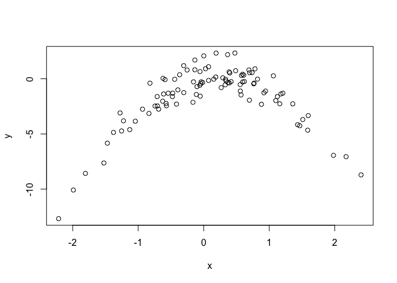

# Chapter5_Feb_6


#5.3.1


```r
library (ISLR)
```

```
## Warning: package 'ISLR' was built under R version 3.4.2
```

```r
set.seed (1)
train=sample (392 ,196) #training set, subset 196 samples out of originoal 392 observations.1
#?sample #Random Samples and Permutations
```


```r
lm.fit <- lm(mpg~horsepower, data = Auto, subset = train)
attach (Auto)
mean((mpg -predict (lm.fit ,Auto))[-train ]^2) # mean() calculate the MSE of the 196 in the validation, -train means all observations that are not in the training set
```

```
## [1] 26.14142
```

```r
#MSE for the linear regression is 26.14 
```

#poly() function to estimate the test error for the quadratic and cubic regressions.

```r
lm.fit2=lm(mpg~poly(horsepower ,2) ,data=Auto ,subset =train )
mean((mpg -predict (lm.fit2 ,Auto))[-train ]^2)
```

```
## [1] 19.82259
```

```r
#19.82
lm.fit3=lm(mpg~poly(horsepower ,3) ,data=Auto ,subset =train )
mean((mpg -predict (lm.fit3 ,Auto))[-train ]^2)
```

```
## [1] 19.78252
```

```r
#19.78
```

#If we choose a different training set instead, then we will obtain somewhat different errors on the validation set.


```r
set.seed (2)
train=sample (392 ,196)
lm.fit =lm(mpg~horsepower ,subset =train)
mean((mpg -predict (lm.fit ,Auto))[-train ]^2)
```

```
## [1] 23.29559
```

```r
#23.30
lm.fit2=lm(mpg~poly(horsepower ,2) ,data=Auto ,subset =train )
mean((mpg -predict (lm.fit2 ,Auto))[-train ]^2)
```

```
## [1] 18.90124
```

```r
#18.90
lm.fit3=lm(mpg~poly(horsepower ,3) ,data=Auto ,subset =train )
mean((mpg -predict (lm.fit3 ,Auto))[-train ]^2)
```

```
## [1] 19.2574
```

```r
#19.26
```

#5.3.2


```r
#The LOOCV estimate can be automatically computed for any generalized linear model using the glm() and cv.glm() functions.
glm.fit=glm(mpg~horsepower ,data=Auto)
coef(glm.fit)
```

```
## (Intercept)  horsepower 
##  39.9358610  -0.1578447
```

```r
#(Intercept ) horsepower
#39.936 -0.158

lm.fit =lm(mpg~horsepower ,data=Auto)
coef(lm.fit)
```

```
## (Intercept)  horsepower 
##  39.9358610  -0.1578447
```

```r
#(Intercept ) horsepower
#39.936 -0.158
#we will perform linear regression using the glm() function rather than the lm() function because the former can be used together with cv.glm(). 
```


```r
library (boot) #The cv.glm() function is part of the boot library.
glm.fit=glm(mpg~horsepower ,data=Auto)
cv.err =cv.glm(Auto ,glm.fit) #This function calculates the estimated K-fold cross-validation prediction error for generalized linear models.
cv.err$delta
```

```
## [1] 24.23151 24.23114
```

```r
#1 1
#24.23 24.23
#The cv.glm() function produces a list with several components. The two numbers in the delta vector contain the cross-validation results.
```


```r
cv.error=rep (0,5)
for (i in 1:5){
glm.fit=glm(mpg~poly(horsepower ,i),data=Auto)
cv.error[i]=cv.glm (Auto ,glm.fit)$delta [1]
}
cv.error
```

```
## [1] 24.23151 19.24821 19.33498 19.42443 19.03321
```

```r
#[1] 24.23 19.25 19.33 19.42 19.03
```

#5.3.3 k-Fold Cross-Validation


```r
set.seed (17)
cv.error.10= rep (0 ,10)
for (i in 1:10) {
glm.fit=glm(mpg~poly(horsepower ,i),data=Auto)
cv.error.10[i]=cv.glm (Auto ,glm.fit ,K=10) $delta [1]
}
cv.error.10
```

```
##  [1] 24.20520 19.18924 19.30662 19.33799 18.87911 19.02103 18.89609
##  [8] 19.71201 18.95140 19.50196
```

```r
#[1] 24.21 19.19 19.31 19.34 18.88 19.02 18.90 19.71 18.95 19.50
```

#Problems
3. We now review k-fold cross-validation.
(a) Explain how k-fold cross-validation is implemented.
k-fold cross-validation is implemented by taking the set of n observations and randomly splitting into k non-overlapping groups. Each of these groups acts as a validation set and the remainder as a training set. The test error is estimated by averaging the k resulting MSE estimates.
(b) What are the advantages and disadvantages of k-fold crossvalidation
relative to:
i. The validation set approach?
ii. LOOCV?
i. The validation set approach is conceptually simple and easily. the observation can simply partitioning the existing training data into two sets. However, there are two drawbacks: (1.) the estimate of the test error rate can be highly variable depending on which observations are included in the training and validation sets. (2.) the validation set error rate may tend to overestimate the test error rate for the model fit on the entire data set.

ii. LOOCV is a special case of k-fold cross-validation with k = n. Thus, LOOCV is the most computationally intense method since the model must be fit n times. Also, LOOCV has higher variance, but lower bias, than k-fold CV.

5. In Chapter 4, we used logistic regression to predict the probability of
default using income and balance on the Default data set. We will
now estimate the test error of this logistic regression model using the
validation set approach. Do not forget to set a random seed before
beginning your analysis.

(a) Fit a logistic regression model that uses income and balance to
predict default.


```r
library(ISLR)
summary(Default)
```

```
##  default    student       balance           income     
##  No :9667   No :7056   Min.   :   0.0   Min.   :  772  
##  Yes: 333   Yes:2944   1st Qu.: 481.7   1st Qu.:21340  
##                        Median : 823.6   Median :34553  
##                        Mean   : 835.4   Mean   :33517  
##                        3rd Qu.:1166.3   3rd Qu.:43808  
##                        Max.   :2654.3   Max.   :73554
```

```r
attach(Default)
set.seed(1)
glm.fit = glm(default~income+balance, data=Default, family=binomial)
```

(b) Using the validation set approach, estimate the test error of this
model. In order to do this, you must perform the following steps:
i. Split the sample set into a training set and a validation set.
ii. Fit a multiple logistic regression model using only the training
observations.
iii. Obtain a prediction of default status for each individual in
the validation set by computing the posterior probability of
default for that individual, and classifying the individual to
the default category if the posterior probability is greater
than 0.5.
iv. Compute the validation set error, which is the fraction of
the observations in the validation set that are misclassified.


```r
x = function() {
# i.Split the sample set into a training set and a validation set
train = sample(dim(Default)[1], dim(Default)[1]/2)
# ii.Fit a multiple logistic regression model using only the training observations.
glm.fit = glm(default~income+balance, data=Default, family=binomial,
              subset=train)
# iii.posterior probability
glm.pred = rep("No", dim(Default)[1]/2)
glm.probs = predict(glm.fit, Default[-train,], type="response")
glm.pred[glm.probs>.5] = "Yes"
# iv.validation
return(mean(glm.pred != Default[-train,]$default))
}
x()
```

```
## [1] 0.0286
```

```r
#0.0286
#2.86% test error rate from validation set approach.
```

(c) Repeat the process in (b) three times, using three different splits
of the observations into a training set and a validation set. Comment
on the results obtained.


```r
x() #0.0236
```

```
## [1] 0.0236
```

```r
x() #0.028
```

```
## [1] 0.028
```

```r
x() #0.0268
```

```
## [1] 0.0268
```

```r
#seems to average around 2.6% test error rate.
```

(d) Now consider a logistic regression model that predicts the probability
of default using income, balance, and a dummy variable
for student. Estimate the test error for this model using the validation
set approach. Comment on whether or not including a
dummy variable for student leads to a reduction in the test error
rate.


```r
train = sample(dim(Default)[1], dim(Default)[1]/2)
glm.fit = glm(default~income+balance+student, data=Default, family=binomial,subset=train)
glm.pred = rep("No", dim(Default)[1]/2)
glm.probs = predict(glm.fit, Default[-train,], type="response")
glm.pred[glm.probs>.5] = "Yes"
mean(glm.pred != Default[-train,]$default)
```

```
## [1] 0.0264
```

```r
#2.64% test error rate, with student dummy variable. Using the validation set approach, it doesn't appear adding the student dummy variable leads to a reduction in the test error rate.
```

7. In Sections 5.3.2 and 5.3.3, we saw that the cv.glm() function can be
used in order to compute the LOOCV test error estimate. Alternatively,
one could compute those quantities using just the glm() and predict.glm() functions, and a for loop. You will now take this approach
in order to compute the LOOCV error for a simple logistic
regression model on the Weekly data set. Recall that in the context
of classification problems, the LOOCV error is given in (5.4).

(a) Fit a logistic regressionmodel that predicts Direction using Lag1
and Lag2.


```r
library(ISLR)
summary(Weekly)
```

```
##       Year           Lag1               Lag2               Lag3         
##  Min.   :1990   Min.   :-18.1950   Min.   :-18.1950   Min.   :-18.1950  
##  1st Qu.:1995   1st Qu.: -1.1540   1st Qu.: -1.1540   1st Qu.: -1.1580  
##  Median :2000   Median :  0.2410   Median :  0.2410   Median :  0.2410  
##  Mean   :2000   Mean   :  0.1506   Mean   :  0.1511   Mean   :  0.1472  
##  3rd Qu.:2005   3rd Qu.:  1.4050   3rd Qu.:  1.4090   3rd Qu.:  1.4090  
##  Max.   :2010   Max.   : 12.0260   Max.   : 12.0260   Max.   : 12.0260  
##       Lag4               Lag5              Volume       
##  Min.   :-18.1950   Min.   :-18.1950   Min.   :0.08747  
##  1st Qu.: -1.1580   1st Qu.: -1.1660   1st Qu.:0.33202  
##  Median :  0.2380   Median :  0.2340   Median :1.00268  
##  Mean   :  0.1458   Mean   :  0.1399   Mean   :1.57462  
##  3rd Qu.:  1.4090   3rd Qu.:  1.4050   3rd Qu.:2.05373  
##  Max.   : 12.0260   Max.   : 12.0260   Max.   :9.32821  
##      Today          Direction 
##  Min.   :-18.1950   Down:484  
##  1st Qu.: -1.1540   Up  :605  
##  Median :  0.2410             
##  Mean   :  0.1499             
##  3rd Qu.:  1.4050             
##  Max.   : 12.0260
```

```r
set.seed(1)
attach(Weekly)
glm.fit = glm(Direction~Lag1+Lag2, data=Weekly, family=binomial)
summary(glm.fit)
```

```
## 
## Call:
## glm(formula = Direction ~ Lag1 + Lag2, family = binomial, data = Weekly)
## 
## Deviance Residuals: 
##    Min      1Q  Median      3Q     Max  
## -1.623  -1.261   1.001   1.083   1.506  
## 
## Coefficients:
##             Estimate Std. Error z value Pr(>|z|)    
## (Intercept)  0.22122    0.06147   3.599 0.000319 ***
## Lag1        -0.03872    0.02622  -1.477 0.139672    
## Lag2         0.06025    0.02655   2.270 0.023232 *  
## ---
## Signif. codes:  0 '***' 0.001 '**' 0.01 '*' 0.05 '.' 0.1 ' ' 1
## 
## (Dispersion parameter for binomial family taken to be 1)
## 
##     Null deviance: 1496.2  on 1088  degrees of freedom
## Residual deviance: 1488.2  on 1086  degrees of freedom
## AIC: 1494.2
## 
## Number of Fisher Scoring iterations: 4
```

(b) Fit a logistic regressionmodel that predicts Direction using Lag1
and Lag2 using all but the first observation.


```r
glm.fit = glm(Direction~Lag1+Lag2, data=Weekly[-1,], family=binomial)
summary(glm.fit)
```

```
## 
## Call:
## glm(formula = Direction ~ Lag1 + Lag2, family = binomial, data = Weekly[-1, 
##     ])
## 
## Deviance Residuals: 
##     Min       1Q   Median       3Q      Max  
## -1.6258  -1.2617   0.9999   1.0819   1.5071  
## 
## Coefficients:
##             Estimate Std. Error z value Pr(>|z|)    
## (Intercept)  0.22324    0.06150   3.630 0.000283 ***
## Lag1        -0.03843    0.02622  -1.466 0.142683    
## Lag2         0.06085    0.02656   2.291 0.021971 *  
## ---
## Signif. codes:  0 '***' 0.001 '**' 0.01 '*' 0.05 '.' 0.1 ' ' 1
## 
## (Dispersion parameter for binomial family taken to be 1)
## 
##     Null deviance: 1494.6  on 1087  degrees of freedom
## Residual deviance: 1486.5  on 1085  degrees of freedom
## AIC: 1492.5
## 
## Number of Fisher Scoring iterations: 4
```

(c) Use the model from (b) to predict the direction of the first observation.
You can do this by predicting that the first observation
will go up if P(Direction="Up"|Lag1, Lag2) > 0.5. Was this observation
correctly classified?


```r
predict.glm(glm.fit, Weekly[1,], type="response") > 0.5
```

```
##    1 
## TRUE
```

```r
#TRUE
#Prediction was Up, true Direction was Down.
```

(d) Write a for loop from i = 1 to i = n, where n is the number of
observations in the data set, that performs each of the following
steps:

i. Fit a logistic regression model using all but the ith observation
to predict Direction using Lag1 and Lag2.
ii. Compute the posterior probability of the market moving up
for the ith observation.
iii. Use the posterior probability for the ith observation in order
to predict whether or not the market moves up.
iv. Determine whether or not an error was made in predicting
the direction for the ith observation. If an error was made,
then indicate this as a 1, and otherwise indicate it as a 0.


```r
y = rep(0, dim(Weekly)[1])
for (i in 1:(dim(Weekly)[1])) {
   glm.fit = glm(Direction~Lag1+Lag2, data=Weekly[-i,], family=binomial)
   is_up = predict.glm(glm.fit, Weekly[i,], type="response") > 0.5
   is_true_up = Weekly[i,]$Direction == "Up"
   if (is_up != is_true_up)
     y[i] = 1
}
sum(y)
```

```
## [1] 490
```

```r
#490 errors.
```

(e) Take the average of the n numbers obtained in (d)iv in order to
obtain the LOOCV estimate for the test error. Comment on the
results.


```r
mean(y)
```

```
## [1] 0.4499541
```

```r
#[1] 0.4499541
#LOOCV estimates a test error rate of ~45%.
```

8.We will now perform cross-validation on a simulated data set.
(a) Generate a simulated data set as follows:


```r
set.seed (1)
x=rnorm (100)
y=x-2* x^2+ rnorm (100)
```
In this data set, what is n and what is p? Write out the model
used to generate the data in equation form.

n = 100, p = 2.
Y = X - 2 X^2 + e

(b) Create a scatterplot of X against Y . Comment on what you find.


```r
plot(x,y)
```

<!-- -->

```r
#Quadratic plot. x from about -2 to 2. y from about -8 to 2.
```

(c) Set a random seed, and then compute the LOOCV errors that
result from fitting the following four models using least squares:

i. Y = β0 + β1X + e
ii. Y = β0 + β1X + β2X2 + e
iii. Y = β0 + β1X + β2X2 + β3X3 + e
iv. Y = β0 + β1X + β2X2 + β3X3 + β4X4 + e.

Note you may find it helpful to use the data.frame() function
to create a single data set containing both X and Y .


```r
library(boot)
Data = data.frame(x,y)
set.seed(1)
# i.
glm.fit = glm(y~x)
cv.glm(Data, glm.fit)$delta
```

```
## [1] 7.288162 7.284744
```

```r
#[1] 7.288162 7.284744
# ii.
glm.fit = glm(y~poly(x,2))
cv.glm(Data, glm.fit)$delta
```

```
## [1] 0.9374236 0.9371789
```

```r
#[1] 0.9374236 0.9371789
# iii.
glm.fit = glm(y~poly(x,3))
cv.glm(Data, glm.fit)$delta
```

```
## [1] 0.9566218 0.9562538
```

```r
#[1] 0.9566218 0.9562538
# iv.
glm.fit = glm(y~poly(x,4))
cv.glm(Data, glm.fit)$delta
```

```
## [1] 0.9539049 0.9534453
```

```r
#[1] 0.9539049 0.9534453
```

(d) Repeat (c) using another random seed, and report your results.
Are your results the same as what you got in (c)? Why?


```r
set.seed(10)
# i.
glm.fit = glm(y~x)
cv.glm(Data, glm.fit)$delta
```

```
## [1] 7.288162 7.284744
```

```r
#[1] 7.288162 7.284744
# ii.
glm.fit = glm(y~poly(x,2))
cv.glm(Data, glm.fit)$delta
```

```
## [1] 0.9374236 0.9371789
```

```r
# iii.
glm.fit = glm(y~poly(x,3))
cv.glm(Data, glm.fit)$delta
```

```
## [1] 0.9566218 0.9562538
```

```r
#[1] 0.9566218 0.9562538
# iv.
glm.fit = glm(y~poly(x,4))
cv.glm(Data, glm.fit)$delta
```

```
## [1] 0.9539049 0.9534453
```

```r
#[1] 0.9539049 0.9534453
#they are the same, because LOOCV will be the same since it evaluates n folds of a single observation.
```

(e) Which of the models in (c) had the smallest LOOCV error? Is
this what you expected? Explain your answer.

The quadratic polynomial had the lowest LOOCV test error rate. This was expected because it matches the true form of Y

(f) Comment on the statistical significance of the coefficient estimates
that results from fitting each of the models in (c) using
least squares. Do these results agree with the conclusions drawn
based on the cross-validation results?


```r
summary(glm.fit)
```

```
## 
## Call:
## glm(formula = y ~ poly(x, 4))
## 
## Deviance Residuals: 
##     Min       1Q   Median       3Q      Max  
## -2.0550  -0.6212  -0.1567   0.5952   2.2267  
## 
## Coefficients:
##              Estimate Std. Error t value Pr(>|t|)    
## (Intercept)  -1.55002    0.09591 -16.162  < 2e-16 ***
## poly(x, 4)1   6.18883    0.95905   6.453 4.59e-09 ***
## poly(x, 4)2 -23.94830    0.95905 -24.971  < 2e-16 ***
## poly(x, 4)3   0.26411    0.95905   0.275    0.784    
## poly(x, 4)4   1.25710    0.95905   1.311    0.193    
## ---
## Signif. codes:  0 '***' 0.001 '**' 0.01 '*' 0.05 '.' 0.1 ' ' 1
## 
## (Dispersion parameter for gaussian family taken to be 0.9197797)
## 
##     Null deviance: 700.852  on 99  degrees of freedom
## Residual deviance:  87.379  on 95  degrees of freedom
## AIC: 282.3
## 
## Number of Fisher Scoring iterations: 2
```

```r
#p-values show statistical significance of linear and quadratic terms, agrees with the CV result
```

